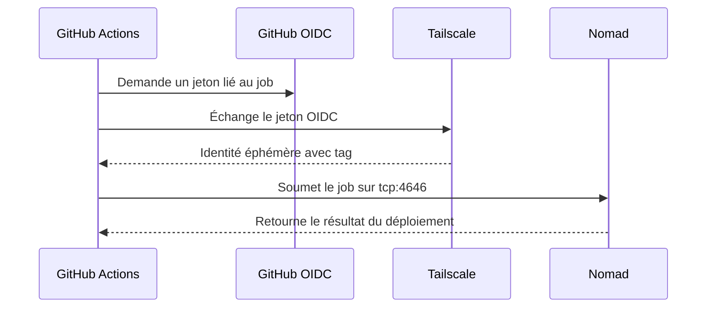

# Déploiement

Ce document décrit le déploiement de Froment Software.

Le guide de plateforme se trouve dans `nixconfig/docs/hosting-and-deployment.md`.

## Environnements

L’application utilise trois environnements :

| Environnement | Adresse                            | Exécution   | Données |
| ------------- | ---------------------------------- | ----------- | ------- |
| développement | `http://localhost:4200`            | poste local | aucune  |
| staging       | `https://staging.froment.software` | Nomad       | aucune  |
| production    | `https://froment.software`         | Nomad       | aucune  |

`APP_ENV` identifie l’environnement.

`SITE_PHASE` contrôle le message public `construction` ou `live`.

Ces deux valeurs restent indépendantes.

Staging et production utilisent `NODE_ENV=production`.

## Chaîne de déploiement

```mermaid
flowchart LR
  Commit[Commit accepté sur master] --> Check[Checks Nix]
  Check --> Image[Image OCI]
  Image --> Evidence[SBOM, provenance et signature]
  Evidence --> Registry[Digest immuable dans GHCR]
  Registry --> Staging[Job Nomad staging]
  Staging --> Approval[Approbation production]
  Approval --> Verify[Vérification des preuves]
  Verify --> Production[Job Nomad production]
```



Chaque commit accepté sur `master` produit une image.

La CI publie l’image dans GitHub Container Registry (GHCR).

Les checks et la publication utilisent des runners GitHub hébergés.

Le serveur cible n’héberge aucun runner GitHub Actions.

La CI déploie ensuite son digest sur staging.

La promotion production reprend le digest actif sur staging.

Elle ne reconstruit pas l’image.

## Contrôles de branche

Le projet utilise le développement trunk-based.

Créez une branche courte pour chaque changement.

Ouvrez une pull request vers `master`.

Fusionnez uniquement après la réussite du check `check`.

Chaque commit accepté sur `master` déclenche staging.

L’environnement GitHub `production` exige une approbation.

## Accès privé au plan de contrôle

Les runners GitHub rejoignent temporairement le réseau Tailscale.

La fédération utilise GitHub OpenID Connect (OIDC).

Elle n’utilise pas de clé Tailscale persistante.

Le sujet autorisé est `repo:sachahjkl@32895534/*:environment:*`.

Le tag `tag:github-actions-deploy` accède uniquement à `tag:nixconfig-server` sur `tcp:4646`.

L’API Nomad écoute sur l’adresse Tailscale du serveur.

Elle n’est pas exposée par nginx.



## Vitrine indépendante

Le job `froment-software` lance `froment-software-marketing`.
Il sert les pages publiques, `/runtime-config.js` et `/api/health` sans ouvrir la base métier.
Il ne lance aucun worker métier et ne monte aucun volume.
Les anciennes URL `/backoffice/*` et `/quote/*` redirigent vers `backoffice.froment.software`.
La vitrine ne sert pas les anciennes routes API métier.

`/runtime-config.js` contient uniquement `APP_ENV`, `SITE_PHASE`, `GITHUB_REPOSITORY_URL` et le commit déployé.
Gardez les secrets métier dans le job `backoffice` du dépôt `backoffice`.

## Spécifications Nomad

Le Nomad Pack dans `deploy` décrit les deux charges de travail.

`application.yaml` déclare les domaines, le port et la santé.

GitHub OIDC fournit un jeton Nomad temporaire pour l’environnement demandé.

## Vérification staging

Après un déploiement staging, vérifiez les points suivants :

1. Vérifiez que le déploiement Nomad est réussi.
2. Vérifiez que le digest prévu est actif.
3. Vérifiez que `/api/health` retourne HTTP 200.
4. Vérifiez que le site public retourne HTTP 200.
5. Vérifiez l’en-tête `X-Robots-Tag: noindex, nofollow`.
6. Vérifiez que le bandeau identifie staging.
7. Vérifiez que `/api/auth/account` ne sert plus l’API métier.

Staging reste public.

Il ne doit pas retourner `WWW-Authenticate`.

## Promotion production

Déclenchez `.github/workflows/deploy-production.yml`.

Approuvez le job dans l’environnement GitHub `production`.

Le workflow vérifie la signature et la provenance du digest staging.

Avant de promouvoir cette version en production, préparez le transfert de la base métier vers le job `backoffice`.
La promotion arrête les workers de l’ancien job.
Consultez la procédure de migration dans le dépôt `backoffice`.

Après le déploiement, vérifiez les points suivants :

1. Vérifiez que les digests staging et production sont identiques.
2. Vérifiez que `/api/health` retourne HTTP 200.
3. Vérifiez les redirections `/backoffice/login` et `/quote`.
4. Vérifiez que l’ancienne API métier est inaccessible.
5. Vérifiez le libellé lié à `SITE_PHASE`.

`SITE_PHASE=live` affiche la vitrine publique.

## Retour arrière

Pour une erreur applicative sans migration, restaurez la version Nomad précédente.

```sh
nomad job history froment-software-production
nomad job revert froment-software-production VERSION
```

La base métier relève de la procédure de restauration du dépôt `backoffice`.
Ne réactivez pas les anciens workers si le nouveau job traite déjà ces données.
