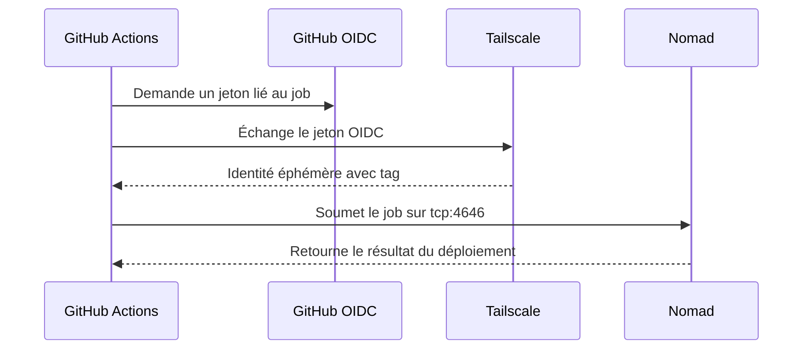

# Déploiement

Ce document décrit le déploiement de Froment Software.

Le guide de plateforme se trouve dans `nixconfig/docs/hosting-and-deployment.md`.

## Environnements

L’application utilise trois environnements :

| Environnement | Adresse | Exécution | Données |
|---|---|---|---|
| développement | `http://localhost:4200` | poste local | base locale |
| staging | `https://staging.froment.software` | Nomad | volume staging |
| production | `https://froment.software` | Nomad | volume production |

`APP_ENV` identifie l’environnement.

`SITE_PHASE` contrôle le message public `construction` ou `live`.

Ces deux valeurs restent indépendantes.

Staging et production utilisent `NODE_ENV=production`.

## Chaîne de déploiement

```mermaid
flowchart LR
  Commit[Commit accepté sur master] --> Check[Checks Nix]
  Check --> Image[Image OCI]
  Image --> Evidence[SBOM, provenance et signature]
  Evidence --> Registry[Digest immuable dans GHCR]
  Registry --> Staging[Job Nomad staging]
  Staging --> Approval[Approbation production]
  Approval --> Verify[Vérification des preuves]
  Verify --> Production[Job Nomad production]
```



Chaque commit accepté sur `master` produit une image.

La CI publie l’image dans GitHub Container Registry (GHCR).

La CI déploie ensuite son digest sur staging.

La promotion production reprend le digest actif sur staging.

Elle ne reconstruit pas l’image.

## Contrôles de branche

Le projet utilise le développement trunk-based.

Créez une branche courte pour chaque changement.

Ouvrez une pull request vers `master`.

Fusionnez uniquement après la réussite du check `check`.

Chaque commit accepté sur `master` déclenche staging.

L’environnement GitHub `production` exige une approbation.

## Accès privé au plan de contrôle

Les runners GitHub rejoignent temporairement le réseau Tailscale.

La fédération utilise GitHub OpenID Connect (OIDC).

Elle n’utilise pas de clé Tailscale persistante.

Le sujet autorisé est `repo:sachahjkl@32895534/*:environment:*`.

Le tag `tag:github-actions-deploy` accède uniquement à `tag:nixconfig-server` sur `tcp:4646`.

L’API Nomad écoute sur l’adresse Tailscale du serveur.

Elle n’est pas exposée par nginx.



## Secrets

Nomad Variables stocke deux ensembles séparés.

Chaque namespace utilise `nomad/jobs/froment-software`.

Le namespace Nomad distingue la valeur staging de la valeur production.

Les valeurs peuvent être identiques pendant une phase de transition.

Les chemins, droits et cycles de rotation restent séparés.

Nomad injecte les secrets au démarrage avec un bloc `template`.

Angular reçoit uniquement `APP_ENV` et `SITE_PHASE` dans `/runtime-config.js`.

N’ajoutez jamais un secret applicatif dans cette ressource publique.

L’API valide `PASETO_SECRET_KEY` comme une paire Ed25519 complète au démarrage.

## Données persistantes

Chaque environnement possède un volume Nomad distinct.

| Environnement | Volume |
|---|---|
| staging | `67d2bb7c-5ef9-4b65-c100-09d9fb991365` |
| production | `d4579349-f86c-330b-381a-bb854f49db21` |

Le conteneur utilise `/var/lib/froment-software/froment.sqlite`.

`tools/prepare.sh` sauvegarde la base avant une migration.

Le script vérifie `PRAGMA integrity_check` et `PRAGMA foreign_key_check`.

La production refuse de démarrer avec une base absente.

Ce contrôle évite une production vide après une erreur de montage.

## Spécifications Nomad

Les fichiers suivants décrivent les charges de travail :

- `deploy/nomad/staging.nomad.hcl`
- `deploy/nomad/production.nomad.hcl`
- `deploy/nomad/staging.volume.hcl`
- `deploy/nomad/production.volume.hcl`
- `deploy/nomad/staging-policy.hcl`
- `deploy/nomad/production-policy.hcl`

Chaque environnement utilise un jeton Nomad limité à son namespace.

Un jeton staging ne peut pas lire les ressources production.

## Vérification staging

Après un déploiement staging, vérifiez les points suivants :

1. Vérifiez que le déploiement Nomad est réussi.
2. Vérifiez que le digest prévu est actif.
3. Vérifiez que `/api/health` retourne HTTP 200.
4. Vérifiez que le site public retourne HTTP 200.
5. Vérifiez l’en-tête `X-Robots-Tag: noindex, nofollow`.
6. Vérifiez que le bandeau identifie staging.
7. Vérifiez une connexion et une route authentifiée.

Staging reste public.

Il ne doit pas retourner `WWW-Authenticate`.

## Promotion production

Déclenchez `.github/workflows/deploy-production.yml`.

Approuvez le job dans l’environnement GitHub `production`.

Le workflow vérifie la signature et la provenance du digest staging.

La tâche Nomad `prepare` sauvegarde la base avant la migration et le démarrage.

Après le déploiement, vérifiez les points suivants :

1. Vérifiez que les digests staging et production sont identiques.
2. Vérifiez que `/api/health` retourne HTTP 200.
3. Vérifiez que la connexion fonctionne.
4. Vérifiez les journaux et les traces.
5. Vérifiez le libellé lié à `SITE_PHASE`.

Conservez `SITE_PHASE=construction` avant le lancement public.

Passez cette valeur à `live` lors du lancement.

## Retour arrière

Pour une erreur applicative sans migration, restaurez la version Nomad précédente.

```sh
nomad job history froment-software-production
nomad job revert froment-software-production VERSION
```

Pour une erreur de migration, arrêtez d’abord l’allocation défaillante.

Restaurez ensuite la sauvegarde vérifiée qui précède la migration.

Soumettez enfin le digest précédent.

Conservez les journaux de l’allocation pour l’analyse.
