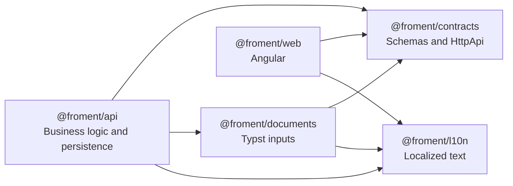
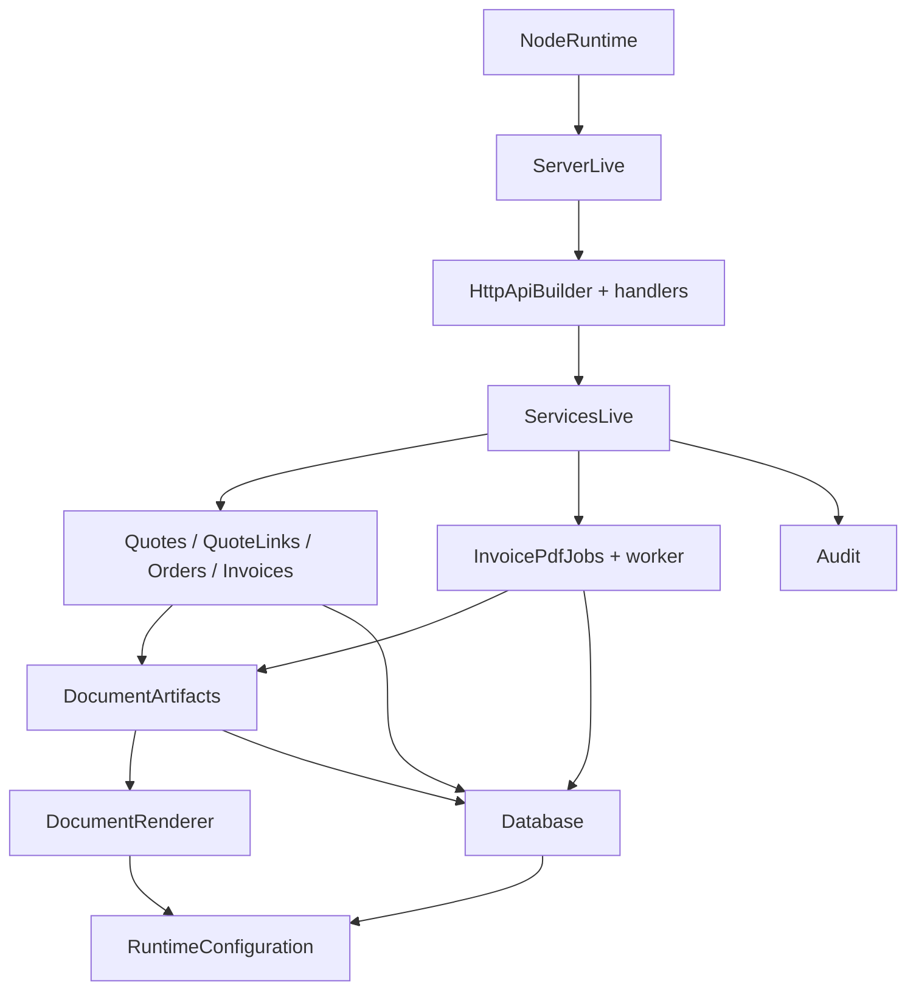
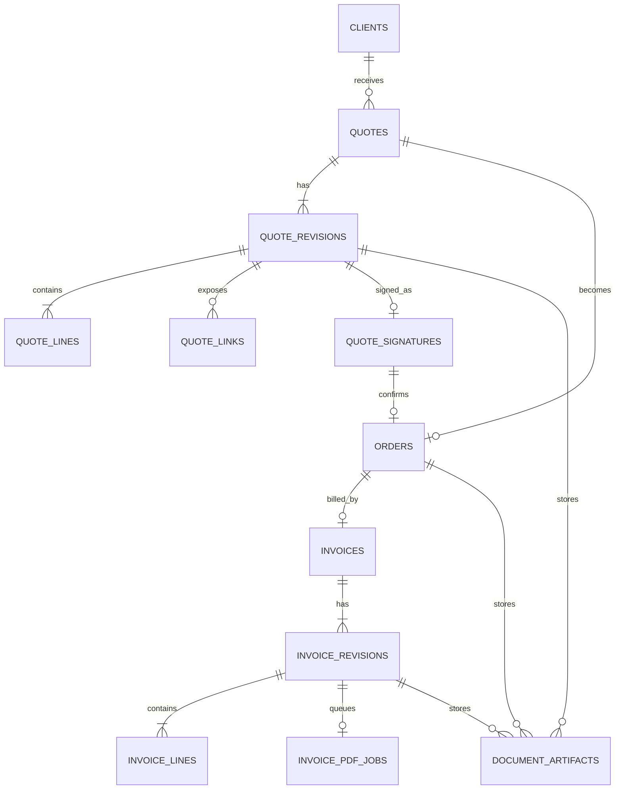
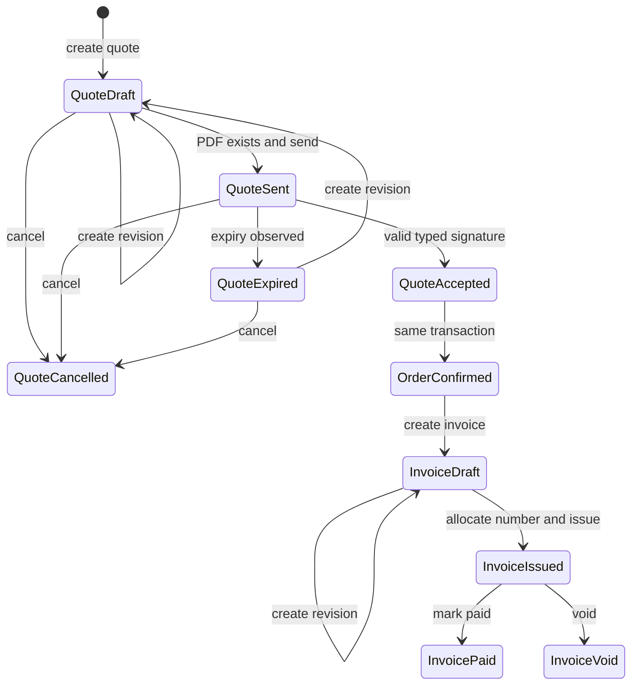
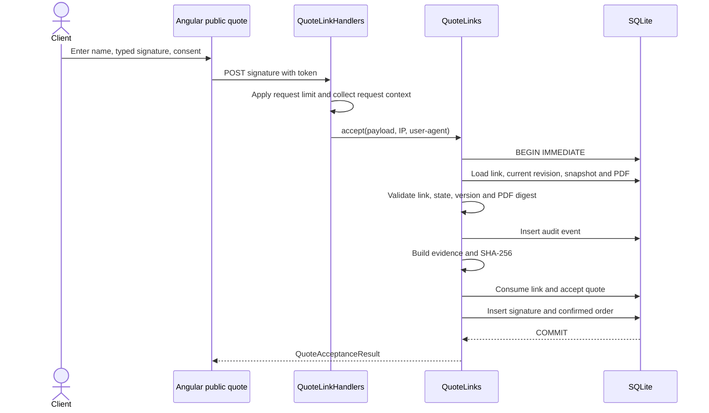
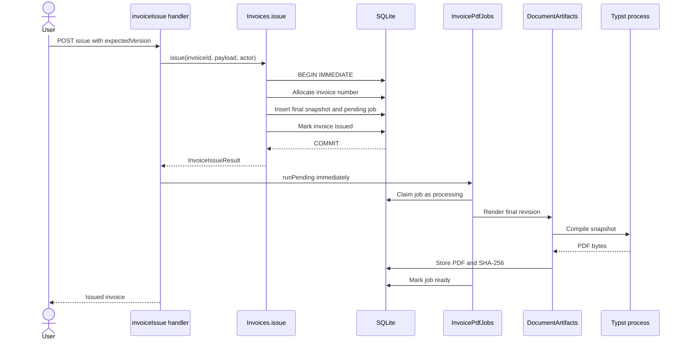
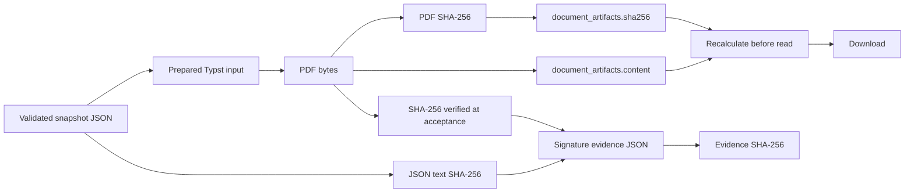

This application does not only separate a web interface from a server. It separates contracts, text, document preparation, business effects and their execution. This structure is most visible when a signed quote must remain linked to an order, an invoice and their PDFs.

This article describes the code present in the repository in August 2026. It distinguishes implemented guarantees from possible intentions.

## Table of contents

- [Five packages, five responsibilities](#five-packages-five-responsibilities)
- [Contracts before handlers](#contracts-before-handlers)
- [Explicit Effect layers](#explicit-effect-layers)
- [SQLite and Drizzle as the last barrier](#sqlite-and-drizzle-as-the-last-barrier)
- [From quote to invoice](#from-quote-to-invoice)
- [Signing a quote without an intermediate state](#signing-a-quote-without-an-intermediate-state)
- [Snapshots freeze the document](#snapshots-freeze-the-document)
- [Typst compiles in an isolated workspace](#typst-compiles-in-an-isolated-workspace)
- [Issuing an invoice before producing its PDF](#issuing-an-invoice-before-producing-its-pdf)
- [An integrity chain based on SHA-256](#an-integrity-chain-based-on-sha-256)
- [What this architecture actually guarantees](#what-this-architecture-actually-guarantees)

## Five packages, five responsibilities

The `pnpm` workspace includes each directory under `packages/*`. It contains five application packages. See `pnpm-workspace.yaml` and the `packages/*/package.json` files.

`@froment/contracts` contains Effect schemas, typed errors and `HttpApi` groups. `@froment/web` reuses these schemas to decode HTTP responses. See `packages/contracts/src/api.ts`, `packages/web/src/app/shared/api-outcome.ts` and `packages/web/src/app/back-office/quotes-api.ts`.

`@froment/documents` does not start Typst. It transforms business snapshots into validated document data. `@froment/api` manages the Typst process, SQLite and transactions. See `packages/documents/src/document-input.ts` and `packages/api/src/documents/document-renderer.ts`.

`@froment/l10n` centralizes document labels among other text. Generated documents currently use French text and `fr-FR` monetary formatting. See `packages/l10n/src/document-text.ts` and `packages/documents/src/document-input.ts`.

## Contracts before handlers

The contracts are not only TypeScript types. `QuoteCreateRequest`, `InvoiceRenderSnapshot` and business errors are `Schema` values. Constraints cover lengths, ULIDs, states, dates and totals. See `packages/contracts/src/quotes/contracts.ts`, `packages/contracts/src/invoices/contracts.ts` and `packages/contracts/src/documents/lines.ts`.

The `HttpApi` groups associate each route with its input, output and errors. They also add authentication, permissions and rate limits. See `packages/contracts/src/quotes/api.ts`, `packages/contracts/src/quote-links/api.ts` and `packages/contracts/src/invoices/api.ts`.

The server then connects these contracts to handlers with `HttpApiBuilder.group`. It also publishes French and English OpenAPI specifications. See `packages/api/src/quotes/handlers.ts`, `packages/api/src/invoices/handlers.ts` and `packages/api/src/server.ts`.

This separation provides three concrete validations:

- the HTTP input is decoded according to the contract;
- the service handles constrained business values;
- the Angular client decodes received responses again.

Monetary calculations are part of the contract. A quantity uses thousandths, a price uses cents and a rate uses basis points. Filters recalculate each line and document total with integers and `bigint`. See `packages/contracts/src/documents/lines.ts` and `packages/api/src/documents/calculation.ts`.

## Explicit Effect layers

Services use `Context.Service`, and their implementations use `Layer.effect`. Dependencies therefore appear in program composition instead of an implicit global container.

`main.ts` first assembles the quote, invoice, order and rendering core. It then adds artifacts and the worker. Finally, it provides the database, configuration, authentication, audit and observability. See `packages/api/src/main.ts`.

This composition does not turn SQLite into an asynchronous service. `better-sqlite3` remains synchronous. Effect still manages acquisition, release, errors, configuration, repeated tasks and fiber lifetimes. See `packages/api/src/database/database.ts` and `packages/api/src/invoices/pdf-jobs.ts`.

## SQLite and Drizzle as the last barrier

Drizzle describes tables, indexes, foreign keys and `CHECK` constraints. Business code then uses both the Drizzle instance and direct SQL access from `better-sqlite3`. See `packages/api/src/database/schema.ts` and `packages/api/src/database/database.ts`.

Constraints deliberately repeat several schema rules. SQLite checks states, unique versions, references, amounts and the relationship between an artifact and its owner. See `packages/api/src/database/schema.ts`.

When the database opens, it enables WAL, foreign keys, a busy timeout and `synchronous = FULL`. Critical business writes use `immediate` transactions. See `packages/api/src/database/database.ts`, `packages/api/src/quotes/quotes.ts`, `packages/api/src/quote-links/service.ts` and `packages/api/src/invoices/invoices.ts`.

Migrations also have protection. Before applying them, the code verifies SHA-256 digests for existing artifacts. It also rejects an applied migration whose recorded hash has changed. See `packages/api/src/database/database.ts`.

## From quote to invoice

The main lifecycle is a sequence of linked documents, not a continuous mutation of one record.

The schema also declares the `rejected` quote state. No examined handler creates this transition. The diagram therefore shows only implemented transitions. See `packages/contracts/src/quotes/contracts.ts`, `packages/api/src/quotes/quotes.ts`, `packages/api/src/quotes/quote-expiration.ts` and `packages/api/src/quote-links/service.ts`.

A new quote revision is allowed in `draft` or `expired`. It returns the quote to `draft` and increments its version. A new invoice revision is limited to `draft`. Both operations check `expectedVersion`. See `packages/api/src/quotes/quotes.ts` and `packages/api/src/invoices/invoices.ts`.

References use the forms `DE-YYYY-NNNNNN`, `CO-YYYY-NNNNNN` and `FA-YYYY-NNNNNN`. A SQLite counter separates the kind and business year. See `packages/contracts/src/business/contracts.ts` and `packages/api/src/business/business-references.ts`.

## Signing a quote without an intermediate state

A quote can only be sent from `draft`, with the expected version and an existing PDF artifact. The server then creates a random token. The database only stores its HMAC. See `packages/api/src/quote-links/service.ts`.

The public token is placed in the URL fragment after `#`. The browser then sends it in public request bodies. See `packages/api/src/quote-links/service.ts` and `packages/web/src/app/pages/public-quote/public-quote.ts`.

The request requires a non-empty name, consent literally equal to `true` and a non-empty typed signature. Each text field is limited to 160 characters. See `packages/contracts/src/quotes/contracts.ts`.

In one transaction, the service consumes the link, accepts the quote, writes the audit event, stores evidence and creates the confirmed order. Unique indexes prevent multiple signatures or orders for one quote. See `packages/api/src/quote-links/service.ts` and `packages/api/src/database/schema.ts`.

The evidence JSON contains the snapshot, linked identifiers, timestamp, context and the snapshot and PDF digests. The record adds the evidence digest. The code does not present this evidence as a qualified eIDAS signature. See `packages/api/src/quote-links/service.ts` and `packages/l10n/src/translations.ts`.

## Snapshots freeze the document

Each quote revision stores a JSON `render_snapshot`. It includes the issuer, client, calculated lines, totals, reference, revision and template version. See `packages/contracts/src/quotes/contracts.ts` and `packages/api/src/quotes/quotes.ts`.

An initial invoice copies the client, title and lines from the accepted quote snapshot. It adds its dates and payment terms. Each invoice revision then has its own snapshot. See `packages/api/src/invoices/invoices.ts`.

The order does not duplicate another JSON document. `Orders.getSnapshot` rebuilds an `OrderRenderSnapshot` from the accepted revision snapshot and order data. See `packages/api/src/orders/orders.ts`.

This choice prevents a later client or issuer update from changing an old revision. It also keeps rendering data without recalculating from current tables.

## Typst compiles in an isolated workspace

`@froment/documents` prepares one shared structure for quotes, orders and invoices. The invoice adds order and quote references, dates and legal text. See `packages/documents/src/document-input.ts`.

The `document.typ` template only reads `input/document.json`, then delegates layout to `shared.typ`. Rendering uses A4 paper, Cousine and Liberation Mono fonts, a line table and a totals block. See `packages/documents/templates/document.typ` and `packages/documents/templates/shared.typ`.

For each compilation, the API creates a temporary directory with input, output and template subdirectories. It copies two Typst files and writes JSON with mode `0600`. See `packages/api/src/documents/document-renderer.ts`.

The Typst process receives an empty `PATH`, a local package path and `SOURCE_DATE_EPOCH=0`. The `--creation-timestamp 0` option also stabilizes time metadata. A semaphore limits concurrency. The code finally checks the `%PDF-` header and removes the temporary directory. See `packages/api/src/documents/document-renderer.ts` and `packages/api/src/runtime-config.ts`.

## Issuing an invoice before producing its PDF

Invoice issuance separates the business decision from compilation work. The transaction allocates the number, creates a final revision, marks the invoice `issued` and adds a `pending` job. See `packages/api/src/invoices/invoices.ts`.

The handler tries the job immediately after issuance. A failure in this attempt does not turn successful issuance into an HTTP error. See `packages/api/src/invoices/issue.ts`.

A background worker resumes `pending` and `failed` jobs. At startup, it also marks jobs left in `processing` as `failed`. It then retries them according to configured interval and concurrency values. See `packages/api/src/invoices/pdf-jobs.ts`, `packages/api/src/main.ts` and `packages/api/src/runtime-config.ts`.

The atomic claim increments `attempts`. After rendering, the job becomes `ready` or `failed` with the stable `pdf.render_failed` code. Migration triggers also check consistency between job, invoice, revision, version and number. See `packages/api/src/invoices/pdf-jobs.ts` and `packages/api/drizzle/20260822180000_stable_trigger_codes/migration.sql`.

Order PDFs follow a different schedule. The back office can produce one explicitly. The client portal produces it on first request if absent, then reads it from artifacts. See `packages/api/src/orders/handlers.ts` and `packages/api/src/client-portal/handlers.ts`.

## An integrity chain based on SHA-256

A stored artifact contains PDF bytes, size, MIME type and SHA-256. A constraint checks size, `blob` type, digest format and the owner matching the document kind. See `packages/api/src/database/schema.ts`.

The service recalculates the digest before each artifact read through document routes and the portal. A mismatch produces `document.artifact.digest_mismatch`. See `packages/api/src/documents/artifact-integrity.ts`, `packages/api/src/documents/document-artifacts.ts` and `packages/api/src/client-portal/client-portal.ts`.

During signing, the service first verifies the PDF artifact. It then computes digests for the snapshot JSON text, PDF and complete evidence. See `packages/api/src/quote-links/service.ts`.

This chain detects a modification. It is not an asymmetric cryptographic signature of the artifact. The repository stores a digest with the content, then recalculates it.

## What this architecture actually guarantees

The code establishes these properties:

- HTTP and document boundaries use executable schemas;
- each revision retains the data required for its rendering;
- acceptance and order creation are atomic;
- invoice issuance survives a temporary PDF rendering failure;
- a PDF artifact is checked with SHA-256 before it is read;
- SQLite repeats essential invariants with constraints, indexes and triggers;
- Effect layers assemble services and their dependencies.

The code does not claim to provide a qualified eIDAS signature. It also does not sign PDFs with a private key. Its current guarantee is more precise: timestamped evidence links a validated snapshot, a verified PDF, an acceptance and an atomic order.
