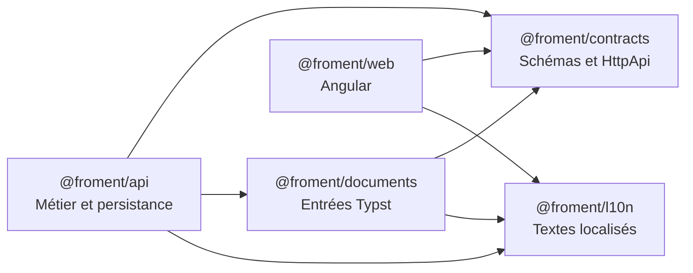
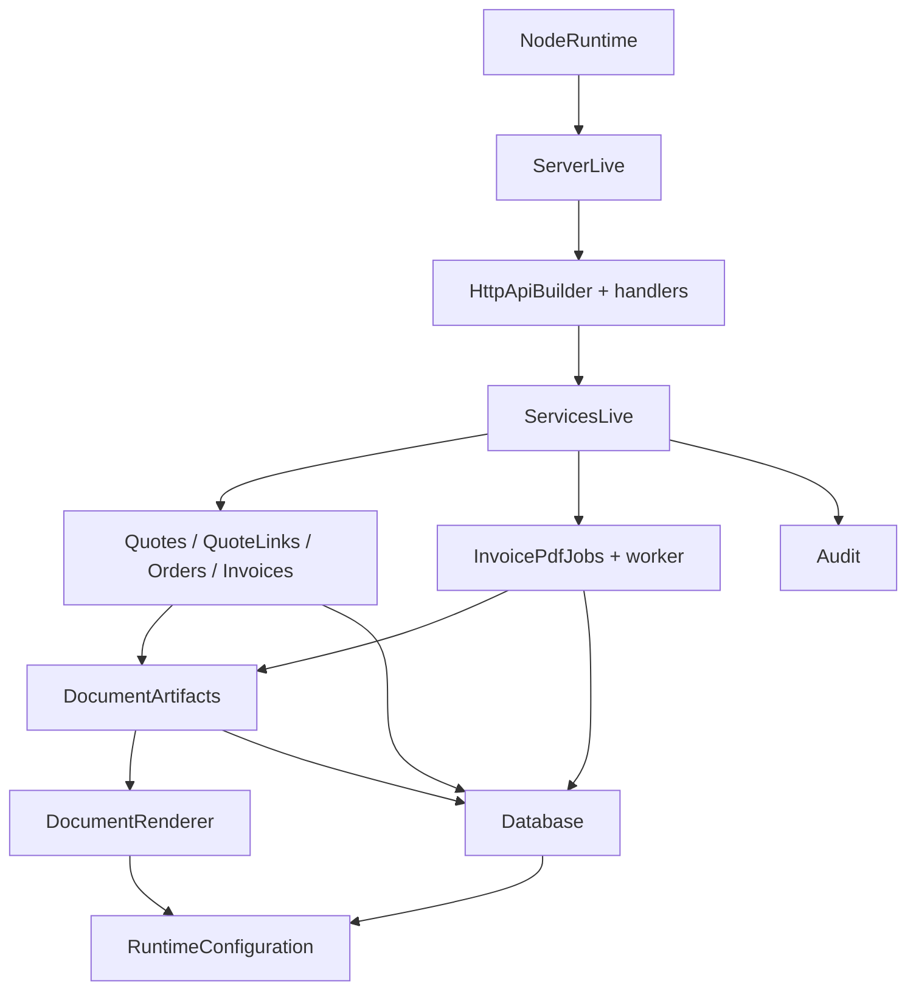
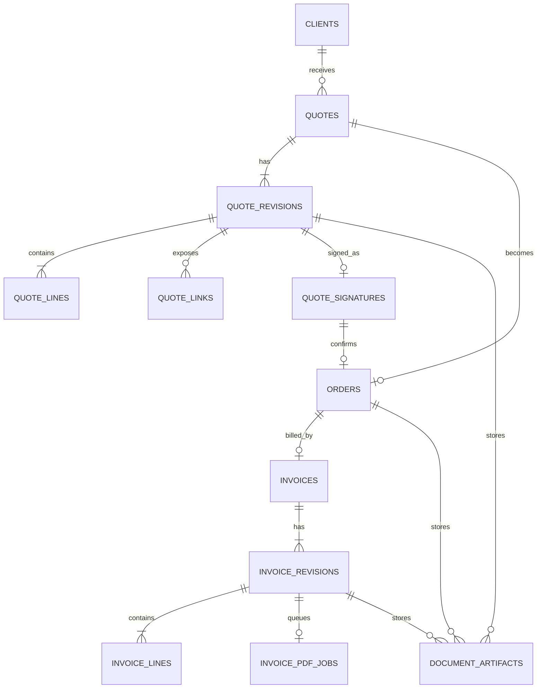
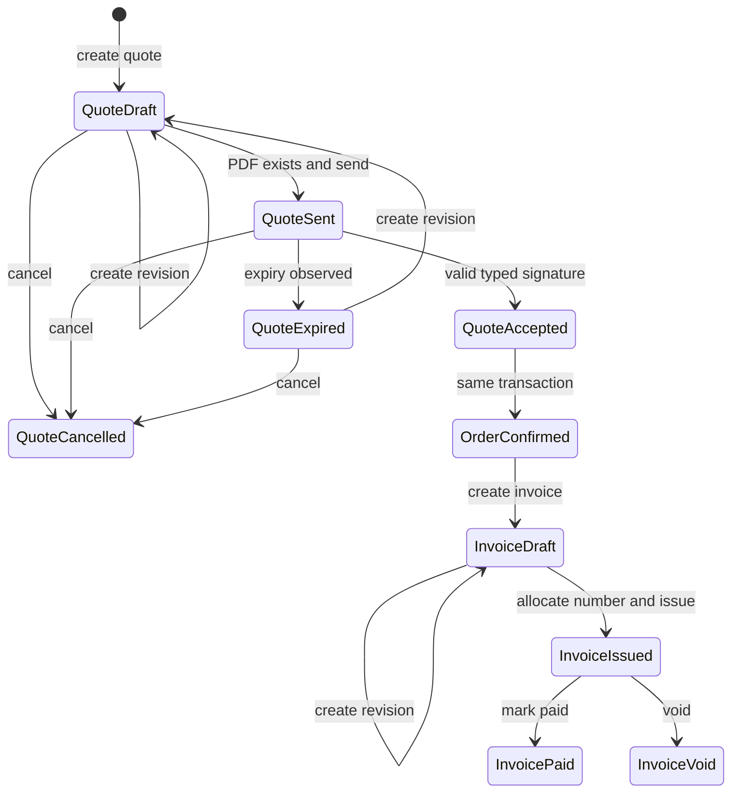
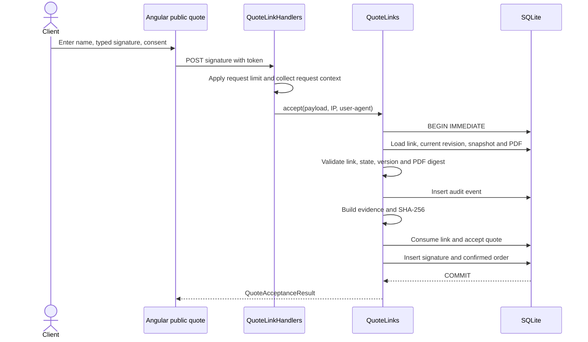
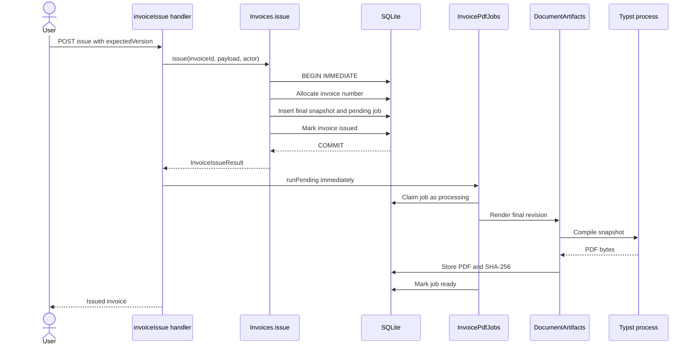
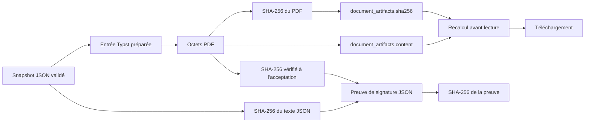

Cette application ne sépare pas seulement une interface web d'un serveur. Elle sépare les contrats, les textes, la préparation documentaire, les effets métier et leur exécution. Cette structure devient surtout visible quand un devis signé doit rester relié à une commande, une facture et leurs PDF.

Cet article décrit le code présent dans le dépôt en août 2026. Il distingue les garanties effectives des intentions possibles.

## Table des matières

- [Cinq packages, cinq responsabilités](#cinq-packages-cinq-responsabilites)
- [Les contrats avant les gestionnaires](#les-contrats-avant-les-gestionnaires)
- [Des couches Effect explicites](#des-couches-effect-explicites)
- [SQLite et Drizzle comme dernier rempart](#sqlite-et-drizzle-comme-dernier-rempart)
- [Du devis à la facture](#du-devis-a-la-facture)
- [Signer un devis sans état intermédiaire](#signer-un-devis-sans-etat-intermediaire)
- [Les snapshots figent le document](#les-snapshots-figent-le-document)
- [Typst compile dans un espace isolé](#typst-compile-dans-un-espace-isole)
- [Émettre une facture avant de produire son PDF](#emettre-une-facture-avant-de-produire-son-pdf)
- [Une chaîne d'intégrité fondée sur SHA-256](#une-chaine-d-integrite-fondee-sur-sha-256)
- [Ce que cette architecture garantit réellement](#ce-que-cette-architecture-garantit-reellement)

## Cinq packages, cinq responsabilités

Le workspace `pnpm` inclut chaque répertoire sous `packages/*`. Il contient cinq packages applicatifs. Voir `pnpm-workspace.yaml` et les fichiers `packages/*/package.json`.

`@froment/contracts` porte les schémas Effect, les erreurs typées et les groupes `HttpApi`. `@froment/web` réutilise ces schémas pour décoder les réponses HTTP. Voir `packages/contracts/src/api.ts`, `packages/web/src/app/shared/api-outcome.ts` et `packages/web/src/app/back-office/quotes-api.ts`.

`@froment/documents` ne lance pas Typst. Il transforme les snapshots métier en données de document validées. `@froment/api` gère le processus Typst, SQLite et les transactions. Voir `packages/documents/src/document-input.ts` et `packages/api/src/documents/document-renderer.ts`.

`@froment/l10n` centralise notamment les libellés des documents. Les documents produits utilisent actuellement les textes français et le format monétaire `fr-FR`. Voir `packages/l10n/src/document-text.ts` et `packages/documents/src/document-input.ts`.

## Les contrats avant les gestionnaires

Les contrats ne sont pas de simples types TypeScript. `QuoteCreateRequest`, `InvoiceRenderSnapshot` et les erreurs métier sont des valeurs `Schema`. Les contraintes couvrent les longueurs, les ULID, les états, les dates et les totaux. Voir `packages/contracts/src/quotes/contracts.ts`, `packages/contracts/src/invoices/contracts.ts` et `packages/contracts/src/documents/lines.ts`.

Les groupes `HttpApi` associent chaque route à son entrée, sa sortie et ses erreurs. Ils ajoutent aussi l'authentification, les permissions et les limites de débit. Voir `packages/contracts/src/quotes/api.ts`, `packages/contracts/src/quote-links/api.ts` et `packages/contracts/src/invoices/api.ts`.

Le serveur relie ensuite ces contrats aux gestionnaires avec `HttpApiBuilder.group`. Il publie aussi les spécifications OpenAPI française et anglaise. Voir `packages/api/src/quotes/handlers.ts`, `packages/api/src/invoices/handlers.ts` et `packages/api/src/server.ts`.

Cette séparation donne trois validations concrètes :

- l'entrée HTTP est décodée selon le contrat.
- le service manipule des valeurs métier déjà contraintes.
- le client Angular redécode les réponses reçues.

Les calculs monétaires font partie du contrat. Une quantité utilise des millièmes, un prix utilise des centimes et un taux utilise des points de base. Les filtres recalculent chaque ligne et les totaux du document avec des entiers et `bigint`. Voir `packages/contracts/src/documents/lines.ts` et `packages/api/src/documents/calculation.ts`.

## Des couches Effect explicites

Les services utilisent `Context.Service` et leurs implémentations utilisent `Layer.effect`. Les dépendances apparaissent donc dans la composition du programme, pas dans un conteneur global implicite.

`main.ts` assemble d'abord le noyau devis, facture, commande et rendu. Il ajoute ensuite les artifacts et le worker. Enfin, il fournit la base, la configuration, l'authentification, l'audit et l'observabilité. Voir `packages/api/src/main.ts`.

Cette composition ne transforme pas SQLite en service asynchrone. `better-sqlite3` reste synchrone. Effect encadre cependant l'acquisition, la libération, les erreurs, la configuration, les tâches répétées et la durée de vie des fibres. Voir `packages/api/src/database/database.ts` et `packages/api/src/invoices/pdf-jobs.ts`.

## SQLite et Drizzle comme dernier rempart

Drizzle décrit les tables, index, clés étrangères et contraintes `CHECK`. Le code métier utilise ensuite l'instance Drizzle et l'accès SQL direct fourni par `better-sqlite3`. Voir `packages/api/src/database/schema.ts` et `packages/api/src/database/database.ts`.

Les contraintes répètent volontairement plusieurs règles des schémas. SQLite contrôle par exemple les états, l'unicité des versions, les références, les montants et la relation entre un artifact et son propriétaire. Voir `packages/api/src/database/schema.ts`.

À l'ouverture, la base active WAL, les clés étrangères, un délai d'attente et `synchronous = FULL`. Les écritures métier critiques utilisent des transactions `immediate`. Voir `packages/api/src/database/database.ts`, `packages/api/src/quotes/quotes.ts`, `packages/api/src/quote-links/service.ts` et `packages/api/src/invoices/invoices.ts`.

Les migrations ont aussi une protection. Avant leur application, le code vérifie les SHA-256 des artifacts existants. Il refuse également une migration déjà enregistrée dont le hash a changé. Voir `packages/api/src/database/database.ts`.

## Du devis à la facture

Le cycle principal est une suite de documents liés, pas une mutation continue du même enregistrement.

Le schéma déclare aussi l'état de devis `rejected`. Aucun gestionnaire examiné ne crée cette transition. Le diagramme montre donc seulement les transitions implémentées. Voir `packages/contracts/src/quotes/contracts.ts`, `packages/api/src/quotes/quotes.ts`, `packages/api/src/quotes/quote-expiration.ts` et `packages/api/src/quote-links/service.ts`.

Une nouvelle révision de devis est autorisée en état `draft` ou `expired`. Elle remet le devis en `draft` et incrémente sa version. Une nouvelle révision de facture est limitée à l'état `draft`. Les deux opérations vérifient `expectedVersion`. Voir `packages/api/src/quotes/quotes.ts` et `packages/api/src/invoices/invoices.ts`.

Les références suivent les formes `DE-AAAA-NNNNNN`, `CO-AAAA-NNNNNN` et `FA-AAAA-NNNNNN`. Un compteur SQLite sépare le type et l'année métier. Voir `packages/contracts/src/business/contracts.ts` et `packages/api/src/business/business-references.ts`.

## Signer un devis sans état intermédiaire

Un devis ne peut être envoyé que depuis `draft`, avec la version attendue et un artifact PDF existant. Le serveur crée alors un jeton aléatoire. La base ne conserve que son HMAC. Voir `packages/api/src/quote-links/service.ts`.

Le jeton public est placé dans le fragment `#` de l'URL. Le navigateur le transmet ensuite dans le corps des requêtes publiques. Voir `packages/api/src/quote-links/service.ts` et `packages/web/src/app/pages/public-quote/public-quote.ts`.

La requête exige un nom non vide, un consentement littéralement égal à `true` et une signature typée non vide. Chaque texte est limité à 160 caractères. Voir `packages/contracts/src/quotes/contracts.ts`.

Dans une seule transaction, le service consomme le lien, accepte le devis, écrit l'audit, stocke la preuve et crée la commande confirmée. Les index uniques empêchent plusieurs signatures ou commandes pour le même devis. Voir `packages/api/src/quote-links/service.ts` et `packages/api/src/database/schema.ts`.

La preuve JSON contient le snapshot, les identifiants liés, l'horodatage, le contexte et les empreintes du snapshot et du PDF. L'enregistrement ajoute l'empreinte de cette preuve. Le code ne présente pas cette preuve comme une signature qualifiée eIDAS. Voir `packages/api/src/quote-links/service.ts` et `packages/l10n/src/translations.ts`.

## Les snapshots figent le document

Chaque révision de devis stocke un `render_snapshot` JSON. Il contient notamment l'émetteur, le client, les lignes calculées, les totaux, la référence, la version et la version du template. Voir `packages/contracts/src/quotes/contracts.ts` et `packages/api/src/quotes/quotes.ts`.

Une facture initiale reprend le client, le titre et les lignes du snapshot du devis accepté. Elle ajoute ses dates et conditions de paiement. Chaque révision de facture possède ensuite son propre snapshot. Voir `packages/api/src/invoices/invoices.ts`.

La commande ne duplique pas un JSON supplémentaire. `Orders.getSnapshot` reconstruit un `OrderRenderSnapshot` depuis le snapshot de la révision acceptée et les données de commande. Voir `packages/api/src/orders/orders.ts`.

Ce choix évite qu'une modification ultérieure du client ou de l'émetteur change une ancienne révision. Il conserve aussi les données nécessaires au rendu sans refaire les calculs depuis des tables courantes.

## Typst compile dans un espace isolé

`@froment/documents` prépare une structure unique pour devis, commande et facture. La facture ajoute les références de commande et de devis, les dates et les mentions légales. Voir `packages/documents/src/document-input.ts`.

Le template `document.typ` lit seulement `input/document.json`, puis délègue la mise en page à `shared.typ`. Le rendu utilise une page A4, les polices Cousine et Liberation Mono, un tableau de lignes et un bloc de totaux. Voir `packages/documents/templates/document.typ` et `packages/documents/templates/shared.typ`.

Pour chaque compilation, l'API crée un répertoire temporaire avec des sous-répertoires d'entrée, de sortie et de templates. Elle copie deux fichiers Typst et écrit le JSON avec le mode `0600`. Voir `packages/api/src/documents/document-renderer.ts`.

Le processus Typst reçoit un `PATH` vide, un chemin de packages local et `SOURCE_DATE_EPOCH=0`. L'option `--creation-timestamp 0` stabilise aussi les métadonnées temporelles. Un sémaphore limite la concurrence. Le code vérifie enfin l'en-tête `%PDF-` et supprime le répertoire temporaire. Voir `packages/api/src/documents/document-renderer.ts` et `packages/api/src/runtime-config.ts`.

## Émettre une facture avant de produire son PDF

L'émission de facture sépare la décision métier du travail de compilation. La transaction attribue le numéro, crée une révision finale, passe la facture à `issued` et ajoute un job `pending`. Voir `packages/api/src/invoices/invoices.ts`.

Le gestionnaire tente le job immédiatement après l'émission. Un échec de cette tentative ne transforme pas l'émission réussie en erreur HTTP. Voir `packages/api/src/invoices/issue.ts`.

Un worker en arrière-plan reprend les jobs `pending` et `failed`. Au démarrage, il marque aussi les jobs restés `processing` comme `failed`. Il les relance ensuite selon l'intervalle et la concurrence configurés. Voir `packages/api/src/invoices/pdf-jobs.ts`, `packages/api/src/main.ts` et `packages/api/src/runtime-config.ts`.

Le claim atomique incrémente `attempts`. Après le rendu, le job devient `ready` ou `failed` avec le code stable `pdf.render_failed`. Des triggers de migration contrôlent aussi la cohérence entre job, facture, révision, version et numéro. Voir `packages/api/src/invoices/pdf-jobs.ts` et `packages/api/drizzle/20260822180000_stable_trigger_codes/migration.sql`.

Le PDF de commande suit un autre rythme. Le back-office peut le produire explicitement. Le portail client le produit à la première demande s'il manque, puis le relit depuis les artifacts. Voir `packages/api/src/orders/handlers.ts` et `packages/api/src/client-portal/handlers.ts`.

## Une chaîne d'intégrité fondée sur SHA-256

Un artifact stocke le contenu PDF, sa taille, son type MIME et son SHA-256. Une contrainte vérifie la taille, le type `blob`, le format de l'empreinte et le propriétaire correspondant au type de document. Voir `packages/api/src/database/schema.ts`.

Le service recalcule l'empreinte avant chaque lecture d'artifact par les routes documentaires et le portail. Une divergence produit `document.artifact.digest_mismatch`. Voir `packages/api/src/documents/artifact-integrity.ts`, `packages/api/src/documents/document-artifacts.ts` et `packages/api/src/client-portal/client-portal.ts`.

Lors de la signature, le service vérifie d'abord l'artifact PDF. Il calcule ensuite les empreintes du texte JSON du snapshot, du PDF et de la preuve complète. Voir `packages/api/src/quote-links/service.ts`.

Cette chaîne détecte une modification. Elle ne constitue pas une signature cryptographique asymétrique de l'artifact. Le dépôt stocke une empreinte avec le contenu, puis la recalcule.

## Ce que cette architecture garantit réellement

Le code établit les propriétés suivantes :

- les frontières HTTP et documentaires utilisent des schémas exécutables.
- chaque révision conserve les données nécessaires à son rendu.
- l'acceptation et la création de commande sont atomiques.
- l'émission de facture survit à un échec temporaire du rendu PDF.
- un artifact PDF est contrôlé par SHA-256 avant sa lecture.
- SQLite répète les invariants essentiels avec des contraintes, index et triggers.
- les services et leurs dépendances sont assemblés par des couches Effect.

Le code ne prétend pas fournir une signature eIDAS qualifiée. Il ne signe pas non plus les PDF avec une clé privée. Sa garantie actuelle est plus précise : une preuve horodatée relie un snapshot validé, un PDF vérifié, une acceptation et une commande atomique.
