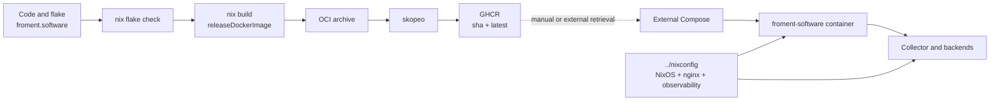
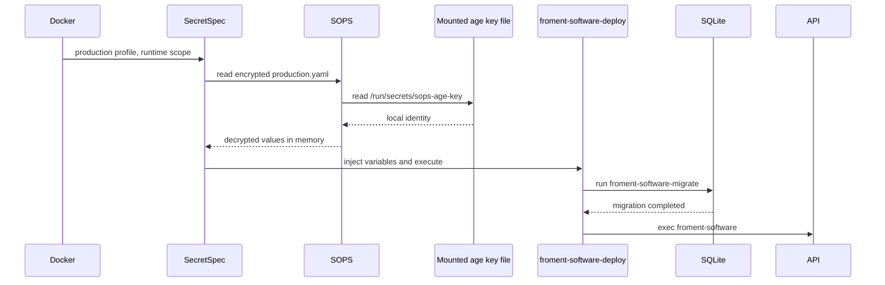
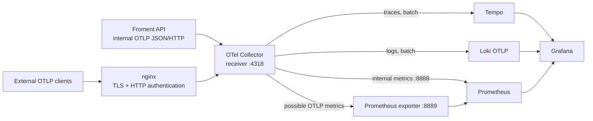
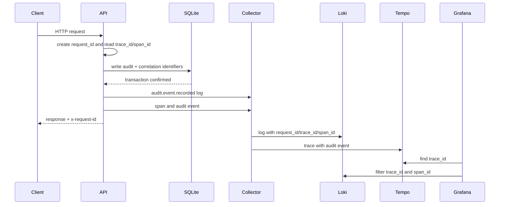

Putting an application into production involves more than producing a container. The system must connect a reproducible build, controlled publication, startup secret resolution, ordered migrations and usable telemetry. This article describes the actual Froment Software chain in August 2026.

## Table of contents

- [Two repositories, three responsibilities](#two-repositories-three-responsibilities)
- [Build the application and image with Nix](#build-the-application-and-image-with-nix)
- [Check and publish in CI](#check-and-publish-in-ci)
- [Resolve secrets at startup](#resolve-secrets-at-startup)
- [Migrate before serving](#migrate-before-serving)
- [Deploy with an external Compose file](#deploy-with-an-external-compose-file)
- [Export logs and traces as OTLP JSON](#export-logs-and-traces-as-otlp-json)
- [Collect, store and inspect](#collect-store-and-inspect)
- [Correlate a request, an audit and a trace](#correlate-a-request-an-audit-and-a-trace)
- [The role of nginx](#the-role-of-nginx)
- [Current limits](#current-limits)
- [What this architecture guarantees](#what-this-architecture-guarantees)

## Two repositories, three responsibilities

The `froment.software` repository contains the code, SecretSpec contract, encrypted SOPS file, Nix build and CI. Its central file is `froment.software/flake.nix`.

The adjacent `../nixconfig` repository contains the server's NixOS configuration. It describes nginx, the shared Docker network and the Loki, Tempo, Prometheus, Grafana and OpenTelemetry Collector stack.

A third part remains outside these repositories: `/data/Docker/appdata/froment.software/compose.yaml`. This external Compose file selects the published image and configures its execution. This separation matters: Nix builds the artifact, CI publishes it, and Compose decides when to run it.

The dotted link shows an intentional, visible limit: the pipeline publishes the image but does not redeploy the service.

## Build the application and image with Nix

`froment.software/flake.nix` pins `nixpkgs` to `nixos-unstable` and exposes `x86_64-linux` and `aarch64-linux`. The build uses an explicit file set through `lib.fileset`. Files outside this set do not enter the Nix source.

Nix prefetched the pnpm dependencies with `fetchPnpmDeps`. The derivation then runs `pnpm build` and installs:

- the compiled API server;
- the compiled migration program;
- the Drizzle migrations;
- the native modules required by SQLite and Argon2;
- the document templates;
- the static Angular site.

Two wrappers expose `froment-software` and `froment-software-migrate`. They set the static-file, migration, template, font and Typst paths. Outside the container, the default SQLite path is `data/froment.sqlite`.

The build also adds `DEPLOYMENT_METADATA`. This JSON value contains the Git revision and workspace package versions. In production, the observability layer converts this data into the `service.version` and `vcs.ref.head.revision` attributes.

Nix creates the image with `dockerTools.buildLayeredImage`, without a Dockerfile. It contains the application, a reduced Node.js 22 runtime, minimal system accounts, SOPS, SecretSpec and the encrypted secret bundle. It declares:

- the unprivileged `froment` user with UID and GID 1000;
- TCP port 3000;
- the `/var/lib/froment-software` volume;
- `DATABASE_PATH=/var/lib/froment-software/froment.sqlite`;
- home, cache and temporary directories writable by that user.

The `releaseDockerImage` package rejects a source without a clean Git revision. The published image thus cannot receive the `unversioned` fallback used by a dirty local build.

## Check and publish in CI

The `froment.software/.github/workflows/ci.yml` workflow runs `nix flake check --print-build-logs`. It uses a hosted Ubuntu runner for a branch or pull request. It uses the self-hosted NixOS runner declared in `../nixconfig/hosts/homelab/homelab.mod.nix` for a push to the default branch.

The flake checks cover:

- the application build;
- the OCI image;
- tests;
- linting;
- formatting;
- pre-commit hooks;
- SecretSpec contract validation;
- the absence of Chromium and Playwright from the production closure.

After the protected check, the `publish` job builds `releaseDockerImage`. `docker/metadata-action` prepares a tag from the full Git SHA and the `latest` tag. Skopeo transfers the Nix OCI archive to GHCR with a temporary authentication file that the job removes on exit.

CI stops after publication. It runs no `docker compose pull`, `docker compose up` or remote deployment command.

## Resolve secrets at startup

`froment.software/secretspec.toml` defines five required application variables for the `production` profile and `runtime` scope. Their names describe signing, hashing or bootstrap keys. The contract stores no clear-text value.

The `runtime` provider points to `sops://secrets/{project}/{profile}.yaml`. SOPS encrypts `froment.software/secrets/froment-software/production.yaml` with age before Nix includes it in the image. This article does not reproduce the age recipient or encrypted values.

The running container mounts only the age key file at `/run/secrets/sops-age-key`. `SOPS_AGE_KEY_FILE` tells SOPS to use that path. The Compose file that defines this mount remains external to the repository.

SecretSpec checks that the required variables exist before it starts the script. The secrets become the child process environment. This script does not write them to a new clear-text file.

This design protects the repository and registry from clear-text values. It does not make the image independent: SOPS cannot resolve the encrypted bundle without the mounted age key, and startup fails.

## Migrate before serving

`froment.software/tools/deploy.sh` contains three relevant operations: `set -eu`, the migration-program call and `exec` of the server.

The migration uses the same `DATABASE_PATH` as the application. It reads the Drizzle files installed in the image. If migration fails, `set -e` stops the script and the server does not start.

After a successful migration, `exec` replaces the shell with Node.js. The server thus becomes the container's main process and receives stop signals directly.

This sequence prevents a binary from serving against an old schema. It provides no coordination between multiple replicas. The current deployment declares one application container.

## Deploy with an external Compose file

Inspection of the active container identifies a Compose project named `fromentsoftware`. It uses `ghcr.io/sachahjkl/froment.software:latest`, the `unless-stopped` restart policy and the external `services` Docker network.

A named volume persists `/var/lib/froment-software`. The age key mount targets `/run/secrets/sops-age-key`. No host port is published: nginx reaches port 3000 through the shared Docker network.

Variable names visible in the active configuration include the internal OTLP endpoint, `PUBLIC_ORIGIN`, `DEPLOYMENT_ENVIRONMENT` and `SOPS_AGE_KEY_FILE`. The container connects directly to the collector through the Docker network.

This Compose file is not versioned in `froment.software` or `../nixconfig`. The application repository therefore cannot check its syntax, changes or agreement with a given revision.

## Export logs and traces as OTLP JSON

`froment.software/packages/api/src/observability/observability.ts` installs Effect's `OtlpTracer` and `OtlpLogger`. `OtlpSerialization.layerJson` selects OTLP JSON serialization, and `FetchHttpClient.layer` provides the HTTP transport.

The OpenTelemetry resource carries:

- `service.name=froment-software`;
- the `@froment/api` package version;
- `deployment.environment.name`;
- `vcs.ref.head.revision`.

The active Compose configuration sets the OTLP endpoint and enables the log and trace exporters. The API installs no application metric exporter.

Each request receives a UUID v4. The response exposes it in `x-request-id`. The request context also stores the current span's 32-character hexadecimal `trace_id` and 16-character hexadecimal `span_id`.

HTTP logs include the method, route, status and, for API routes, operation name. Common annotations add `request.id`, `trace.id` and `span.id`. Traced URLs exclude query parameters and fragments. An allowlist restricts recorded headers; all other headers are redacted.

## Collect, store and inspect

The stack is declared in `../nixconfig/services/homelab-observability.mod.nix`. It runs five containers on the `services` network: OpenTelemetry Collector Contrib, Loki, Tempo, Prometheus and Grafana.

The collector accepts OTLP gRPC on 4317 and OTLP HTTP on 4318. All three pipelines use `memory_limiter` and then `batch`. The processor's internal memory limit is 384 MiB with a 96 MiB spike allowance. This collector setting is not a Docker memory limit.

Froment uses the collector's internal address. It therefore bypasses the public OTLP domain and nginx authentication.

Traces go to Tempo through OTLP gRPC. Logs go to Loki's OTLP HTTP endpoint. The metric pipeline exposes received OTLP metrics in Prometheus format on 8889. The collector exposes its own metrics on 8888.

Loki uses local storage, TSDB schema v13 and a default retention of 720 hours. Tempo uses its local backend with a default retention of 336 hours. Prometheus scrapes every 15 seconds and retains 30 days by default, with a maximum TSDB size of 20 GB.

Prometheus scrapes the collector, Loki, Tempo, Grafana and Prometheus itself. It does not scrape Froment Software metrics because no application Prometheus endpoint is declared.

Grafana provisions three non-editable data sources: Prometheus, Loki and Tempo. The Tempo source enables navigation to Loki with `trace_id` and `span_id` filters. It also references Prometheus for the service map.

## Correlate a request, an audit and a trace

The audit service writes the current context's `request_id`, `trace_id` and `span_id` to SQLite. Constraints check their format. Indexes exist on `request_id` and `trace_id`.

When a business operation creates an audit event, it also adds an `audit.event.recorded` event to the current span. After transaction confirmation, the HTTP layer emits a log with the same name. It includes the audit identifier, action, resource and actor user when available.

This correlation provides three entry points. An operator can start from the `x-request-id` received by a client, the `trace_id` stored in an audit event or a Tempo trace. Grafana then links the trace to Loki logs in the configured time window.

The SQLite audit remains persistent business data. Loki and Tempo hold operational copies with shorter retention periods. Their deletion does not remove the audit event from the database.

## The role of nginx

`../nixconfig/services/homelab-proxy.mod.nix` configures nginx with recommended TLS, proxy, gzip and optimization settings. ACME supplies certificates. The module generates upstreams from current Docker container addresses and reloads nginx when necessary.

`../nixconfig/hosts/homelab/proxy-hosts.mod.nix` connects `froment.software` to the `froment-software` container on port 3000. It also connects the OTLP domain to the collector on port 4318 with HTTP Basic authentication and a 16 MiB body limit. nginx publishes Grafana separately.

`sops-nix` produces the files used for the Grafana administrator password and OTLP authentication. `../nixconfig/modules/homelab-sops.mod.nix` sets their owners, groups and modes, then restarts the affected units after a change.

## Current limits

The architecture exposes several concrete limits:

- CI publishes the image but does not redeploy the container;
- the application Compose file is external to both repositories;
- the application exports logs and traces but no application metrics;
- the collector configures no `spanmetrics` connector or processor;
- the Grafana service map references Prometheus, but `spanmetrics` produces no graph metrics;
- the active Froment container declares no healthcheck;
- this container sets no memory, CPU or process-count limit;
- the observability containers declared in `../nixconfig` also have no healthcheck or OCI resource limits;
- `dependsOn` orders some starts but does not prove that Loki, Tempo or the collector is ready;
- Loki and Tempo use local storage with a replication factor of one;
- mounting an age key in the container lets that container decrypt the SOPS bundle while it runs.

These limits do not make the existing signals incorrect. They define the failures and capabilities that the platform does not yet handle.

## What this architecture guarantees

The current chain provides an OCI artifact built by Nix, checked by the same flake and tied to a clean Git revision. It enforces migrations before the server and resolves secrets before the application.

It also provides continuous correlation across the HTTP response, log, trace and SQLite audit. `request_id`, `trace_id` and `span_id` do not replace business monitoring, but they reduce the time needed to connect a symptom to the affected operation.

The next useful improvement is not to hide the boundaries. Version the deployment, add probes and limits, then select application metrics before enabling `spanmetrics` if that signal meets an actual need.
