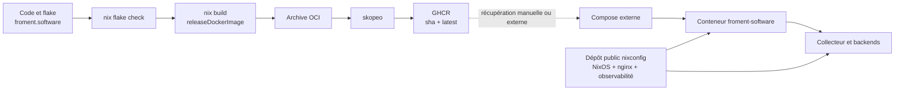
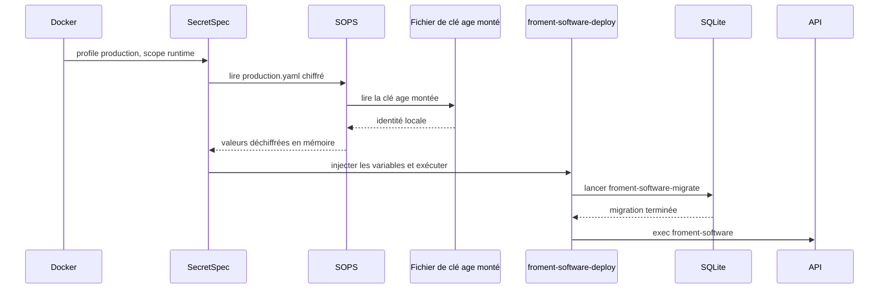
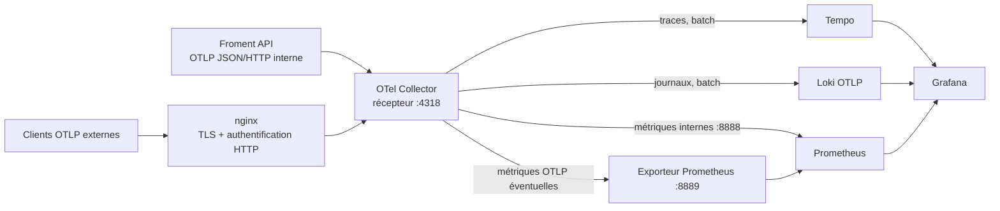
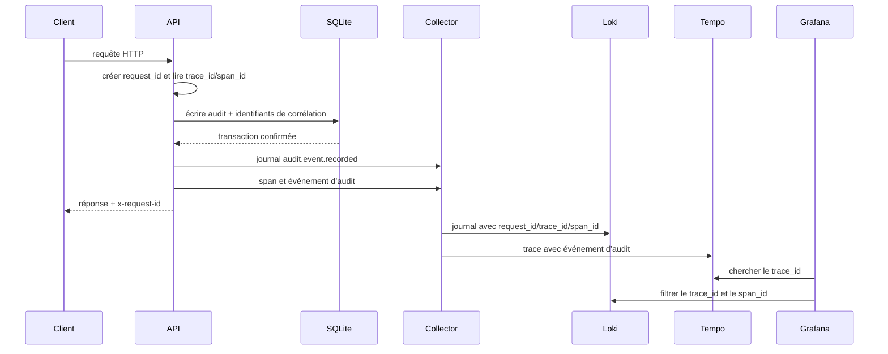

Mettre une application en production ne consiste pas seulement à produire un conteneur. Il faut relier un build reproductible, une publication contrôlée, des secrets résolus au démarrage, des migrations ordonnées et une télémétrie exploitable. Voici l’état réel de cette chaîne pour Froment Software en août 2026.

## Table des matières

- [Deux dépôts, trois responsabilités](#deux-dépôts-trois-responsabilités)
- [Construire l’application et l’image avec Nix](#construire-lapplication-et-limage-avec-nix)
- [Vérifier et publier en CI](#vérifier-et-publier-en-ci)
- [Résoudre les secrets au démarrage](#résoudre-les-secrets-au-démarrage)
- [Migrer avant de servir](#migrer-avant-de-servir)
- [Déployer avec un Compose externe](#déployer-avec-un-compose-externe)
- [Exporter les journaux et les traces en OTLP JSON](#exporter-les-journaux-et-les-traces-en-otlp-json)
- [Collecter, stocker et consulter](#collecter-stocker-et-consulter)
- [Corréler une requête, un audit et une trace](#corréler-une-requête-un-audit-et-une-trace)
- [Rôle de nginx](#rôle-de-nginx)
- [Limites actuelles](#limites-actuelles)
- [Ce que cette architecture garantit](#ce-que-cette-architecture-garantit)

## Deux dépôts, trois responsabilités

Le dépôt `froment.software` contient le code, le contrat SecretSpec, le fichier SOPS chiffré, le build Nix et la CI. Son fichier central est `froment.software/flake.nix`.

Le dépôt public [nixconfig](https://github.com/sachahjkl/nixconfig) contient la configuration NixOS du serveur. Il décrit nginx, le réseau Docker partagé et la pile Loki, Tempo, Prometheus, Grafana et OpenTelemetry Collector.

Une configuration Compose sur l’hôte sélectionne l’image publiée et configure son exécution. Nix construit l’artefact, la CI le publie, puis Compose décide quand l’exécuter.

Le lien en pointillés représente une limite volontairement visible : le pipeline publie l’image, mais ne redéploie pas le service.

## Construire l’application et l’image avec Nix

`froment.software/flake.nix` fixe `nixpkgs` sur `nixos-unstable` et expose les systèmes `x86_64-linux` et `aarch64-linux`. Le build utilise un jeu de fichiers explicite avec `lib.fileset`. Les fichiers absents de ce jeu ne participent pas à la source Nix.

Les dépendances pnpm sont préchargées avec `fetchPnpmDeps`. La dérivation exécute ensuite `pnpm build`, puis installe :

- le serveur API compilé ;
- le programme de migration compilé ;
- les migrations Drizzle ;
- les modules natifs nécessaires à SQLite et Argon2 ;
- les modèles de documents ;
- le site Angular statique.

Deux wrappers exposent `froment-software` et `froment-software-migrate`. Ils fixent notamment les chemins des fichiers statiques, des migrations, des modèles, des polices et de Typst. Le chemin SQLite vaut par défaut `data/froment.sqlite` hors conteneur.

Le build ajoute aussi `DEPLOYMENT_METADATA`. Ce JSON contient la révision Git et les versions des paquets du workspace. En production, la couche d’observabilité transforme ces données en attributs `service.version` et `vcs.ref.head.revision`.

L’image est créée avec `dockerTools.buildLayeredImage`, sans Dockerfile. Elle contient l’application, Node.js 22 réduit, les comptes système minimaux, SOPS, SecretSpec et le paquet chiffré des secrets. Elle déclare :

- l’utilisateur non privilégié `froment`, UID et GID 1000 ;
- le port TCP 3000 ;
- le volume `/var/lib/froment-software` ;
- `DATABASE_PATH=/var/lib/froment-software/froment.sqlite` ;
- des répertoires personnels, de cache et temporaires accessibles à cet utilisateur.

Le paquet `releaseDockerImage` refuse une source sans révision Git propre. L’image publiée ne peut donc pas recevoir la valeur de secours `unversioned` utilisée par un build local sale.

## Vérifier et publier en CI

Le workflow `froment.software/.github/workflows/ci.yml` exécute `nix flake check --print-build-logs`. Pour une branche ou une pull request, il utilise un runner Ubuntu hébergé. Pour un push sur la branche par défaut, il utilise le runner NixOS auto-hébergé déclaré dans [homelab.mod.nix](https://github.com/sachahjkl/nixconfig/blob/master/hosts/homelab/homelab.mod.nix).

Les checks du flake couvrent :

- le build applicatif ;
- l’image OCI ;
- les tests ;
- le lint ;
- le formatage ;
- les hooks pre-commit ;
- la validation du contrat SecretSpec ;
- l’absence de Chromium et Playwright dans la fermeture de production.

Après le check protégé, la tâche `publish` construit `releaseDockerImage`. `docker/metadata-action` prépare un tag lié au SHA Git complet et le tag `latest`. Skopeo transfère l’archive OCI Nix vers GHCR avec un fichier d’authentification temporaire supprimé en fin de tâche.

La CI s’arrête après la publication. Elle ne lance ni `docker compose pull`, ni `docker compose up`, ni commande de déploiement distante.

## Résoudre les secrets au démarrage

`froment.software/secretspec.toml` définit cinq variables applicatives obligatoires pour le profil `production` et le scope `runtime`. Leurs noms décrivent des clés de signature, de hachage ou d’amorçage. Aucune valeur n’est stockée en clair dans le contrat.

Le fournisseur `runtime` pointe vers `sops://secrets/{project}/{profile}.yaml`. `froment.software/secrets/froment-software/production.yaml` est chiffré par SOPS avec age, puis intégré dans l’image. Le destinataire age et les valeurs chiffrées ne sont pas reproduits ici.

Le conteneur monte uniquement le fichier de clé age en lecture seule. La variable `SOPS_AGE_KEY_FILE` indique son emplacement à SOPS.

SecretSpec vérifie la présence des variables requises avant de lancer le script. Les secrets deviennent l’environnement du processus enfant. Ils ne sont pas écrits par ce script dans un nouveau fichier en clair.

Cette conception protège le dépôt et le registre contre les valeurs en clair. Elle ne rend pas l’image indépendante : sans la clé age montée, SOPS ne peut pas résoudre le paquet chiffré et le démarrage échoue.

## Migrer avant de servir

`froment.software/tools/deploy.sh` contient trois opérations utiles : `set -eu`, l’appel au programme de migration, puis `exec` du serveur.

La migration utilise le même `DATABASE_PATH` que l’application. Elle lit les fichiers Drizzle installés dans l’image. Si la migration échoue, `set -e` arrête le script et le serveur ne démarre pas.

Après une migration réussie, `exec` remplace le shell par Node.js. Le serveur devient ainsi le processus principal du conteneur et reçoit directement les signaux d’arrêt.

Cette séquence évite de servir un binaire contre un schéma ancien. Elle ne fournit pas de coordination entre plusieurs réplicas. Le déploiement actuel ne déclare qu’un conteneur applicatif.

## Déployer avec un Compose externe

L’inspection du conteneur actif indique un projet Compose nommé `fromentsoftware`. Il utilise `ghcr.io/sachahjkl/froment.software:latest`, la politique de redémarrage `unless-stopped` et le réseau Docker externe `services`.

Un volume nommé conserve les données applicatives. La clé age est montée en lecture seule. Aucun port hôte n’est publié : nginx atteint le port 3000 par le réseau Docker partagé.

Les noms de variables visibles dans la configuration active incluent l’endpoint OTLP interne, `PUBLIC_ORIGIN`, `DEPLOYMENT_ENVIRONMENT` et `SOPS_AGE_KEY_FILE`. Le conteneur rejoint directement le collecteur sur le réseau Docker.

Cette configuration Compose n’est pas versionnée. Le dépôt applicatif ne peut donc pas vérifier sa syntaxe, son évolution ou sa concordance avec une révision donnée.

## Exporter les journaux et les traces en OTLP JSON

`froment.software/packages/api/src/observability/observability.ts` installe `OtlpTracer` et `OtlpLogger` d’Effect. `OtlpSerialization.layerJson` sélectionne la sérialisation OTLP JSON et `FetchHttpClient.layer` assure le transport HTTP.

La ressource OpenTelemetry porte :

- `service.name=froment-software` ;
- la version du paquet `@froment/api` ;
- `deployment.environment.name` ;
- `vcs.ref.head.revision`.

Le Compose actif configure l’endpoint OTLP et active les exporteurs de journaux et de traces. L’API n’installe pas d’exporteur de métriques applicatives.

Chaque requête reçoit un UUID v4. La réponse expose cet identifiant dans `x-request-id`. Le contexte de requête conserve aussi le `trace_id` de 32 caractères hexadécimaux et le `span_id` de 16 caractères hexadécimaux du span courant.

Les journaux HTTP incluent la méthode, la route, le statut et, pour les routes API, le nom d’opération. Les annotations communes ajoutent `request.id`, `trace.id` et `span.id`. Les URL tracées excluent les paramètres de requête et les fragments. La liste des en-têtes autorisés est restrictive ; les autres en-têtes sont masqués.

## Collecter, stocker et consulter

La pile est déclarée dans [homelab-observability.mod.nix](https://github.com/sachahjkl/nixconfig/blob/master/services/homelab-observability.mod.nix). Elle exécute cinq conteneurs sur le réseau `services` : OpenTelemetry Collector Contrib, Loki, Tempo, Prometheus et Grafana.

Le collecteur accepte OTLP gRPC sur 4317 et OTLP HTTP sur 4318. Les trois pipelines utilisent `memory_limiter`, puis `batch`. La limite mémoire interne du processeur vaut 384 MiB avec une marge de pic de 96 MiB. Ce réglage du collecteur n’est pas une limite mémoire Docker.

Froment utilise l’adresse interne du collecteur. Il ne passe donc pas par le domaine OTLP public ni par l’authentification nginx.

Les traces partent en OTLP gRPC vers Tempo. Les journaux partent vers l’endpoint OTLP HTTP de Loki. Le pipeline de métriques expose les métriques OTLP reçues au format Prometheus sur 8889. Le collecteur expose ses propres métriques sur 8888.

Loki utilise le stockage local, le schéma TSDB v13 et une rétention par défaut de 720 heures. Tempo utilise son backend local avec une rétention par défaut de 336 heures. Prometheus collecte toutes les 15 secondes et conserve par défaut 30 jours, avec une taille TSDB maximale de 20 Go.

Prometheus collecte le collecteur, Loki, Tempo, Grafana et Prometheus lui-même. Il n’extrait pas de métriques depuis Froment Software, car aucun endpoint applicatif Prometheus n’est déclaré.

Grafana provisionne trois sources non modifiables : Prometheus, Loki et Tempo. La source Tempo active la navigation vers Loki avec filtrage par `trace_id` et `span_id`. Elle référence aussi Prometheus pour la carte de services.

## Corréler une requête, un audit et une trace

Le service d’audit écrit dans SQLite les champs `request_id`, `trace_id` et `span_id` du contexte courant. Les contraintes vérifient leur forme. Des index existent sur `request_id` et `trace_id`.

Lorsqu’une opération métier crée un audit, elle ajoute aussi un événement `audit.event.recorded` au span courant. Après confirmation de la transaction, la couche HTTP émet un journal du même nom avec l’identifiant d’audit, l’action, la ressource et, si disponible, l’utilisateur acteur.

Cette corrélation offre trois points d’entrée. Un opérateur peut partir du `x-request-id` reçu par un client, du `trace_id` stocké dans l’audit ou d’une trace Tempo. Grafana relie ensuite la trace aux journaux Loki dans la fenêtre configurée.

L’audit SQLite reste une donnée métier persistante. Loki et Tempo sont des copies d’exploitation avec des périodes de rétention plus courtes. Leur suppression n’efface pas l’événement d’audit de la base.

## Rôle de nginx

[homelab-proxy.mod.nix](https://github.com/sachahjkl/nixconfig/blob/master/services/homelab-proxy.mod.nix) configure nginx avec les réglages recommandés pour TLS, le proxy, gzip et l’optimisation. ACME fournit les certificats. Le module génère des upstreams à partir des adresses actuelles des conteneurs Docker et recharge nginx lorsque nécessaire.

[proxy-hosts.mod.nix](https://github.com/sachahjkl/nixconfig/blob/master/hosts/homelab/proxy-hosts.mod.nix) relie `froment.software` au conteneur `froment-software` sur le port 3000. Il relie aussi le domaine OTLP au collecteur sur 4318 avec authentification HTTP basique et une limite de corps de 16 MiB. Grafana est publié séparément par nginx.

Les fichiers utilisés pour le mot de passe administrateur Grafana et l’authentification OTLP sont produits par `sops-nix`. Le module [homelab-sops.mod.nix](https://github.com/sachahjkl/nixconfig/blob/master/modules/homelab-sops.mod.nix) fixe leurs propriétaires, groupes et modes, puis redémarre les unités concernées lors d’un changement.

## Limites actuelles

L’architecture expose plusieurs limites concrètes :

- la CI publie l’image, mais ne redéploie pas le conteneur ;
- le Compose applicatif est externe aux deux dépôts ;
- l’application exporte des journaux et des traces, mais aucune métrique applicative ;
- le collecteur ne configure pas de connecteur ou processeur `spanmetrics` ;
- la carte de services Grafana référence Prometheus, mais aucune métrique de graphe n’est produite par `spanmetrics` ;
- le conteneur Froment actif ne déclare aucun healthcheck ;
- ce conteneur ne fixe aucune limite mémoire, CPU ou nombre de processus ;
- les conteneurs d’observabilité déclarés dans `nixconfig` n’ont pas non plus de healthcheck ni de limites de ressources OCI ;
- `dependsOn` ordonne certains démarrages, mais ne prouve pas que Loki, Tempo ou le collecteur sont prêts ;
- le stockage Loki et Tempo est local avec un facteur de réplication de un ;
- monter une clé age dans le conteneur autorise ce conteneur à déchiffrer le paquet SOPS pendant son exécution.

Ces limites ne rendent pas les signaux existants faux. Elles définissent les pannes et les capacités que la plateforme ne traite pas encore.

## Ce que cette architecture garantit

La chaîne actuelle fournit un artefact OCI construit par Nix, vérifié par le même flake et relié à une révision Git propre. Elle impose les migrations avant le serveur et résout les secrets avant l’application.

Elle fournit aussi une corrélation continue entre réponse HTTP, journal, trace et audit SQLite. `request_id`, `trace_id` et `span_id` ne remplacent pas l’observation métier, mais ils réduisent le temps nécessaire pour passer d’un symptôme à l’opération concernée.

La prochaine amélioration utile n’est pas de masquer les frontières. Il faut versionner le déploiement, ajouter des sondes et des limites, puis choisir des métriques applicatives avant d’activer `spanmetrics` si ce signal répond à un besoin réel.
