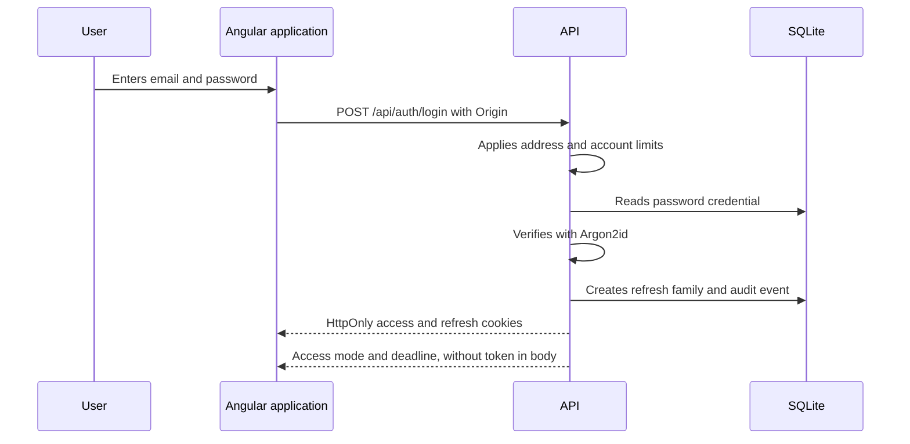
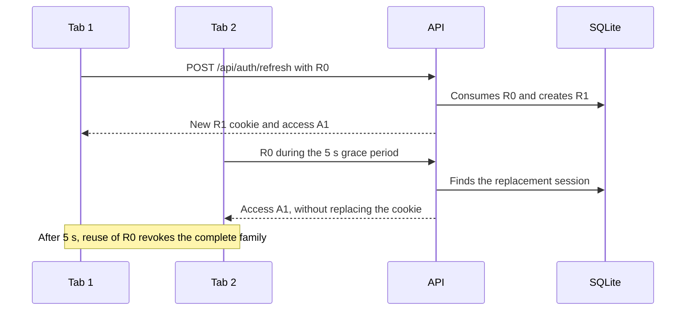
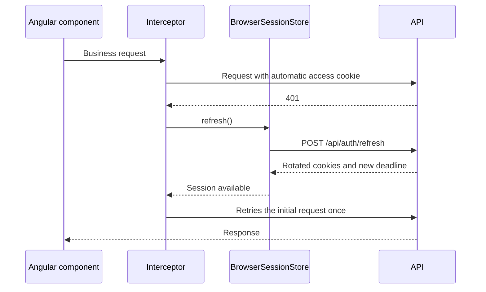
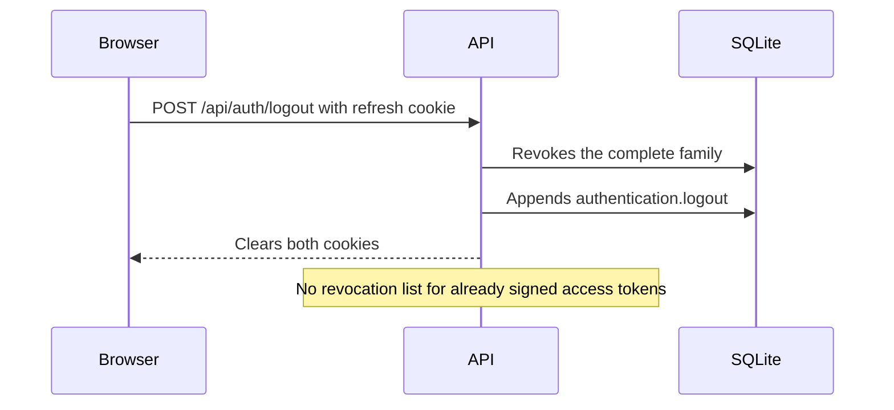
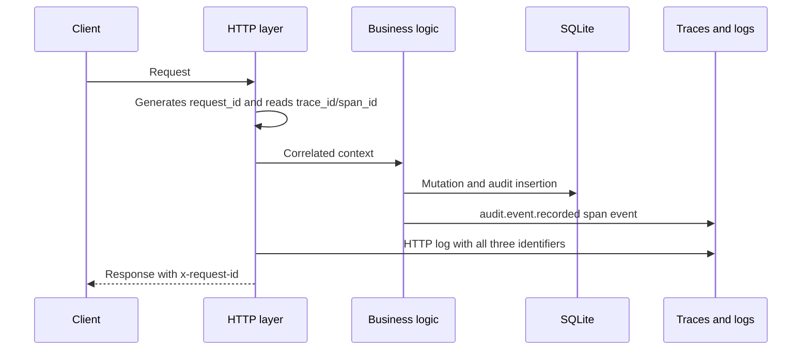

Real application security is not the name of an algorithm. It depends on credential paths, checks on each request, stored state, and known limits. This article describes the current Froment Software implementation from its source code. It contains no key, token, or secret value.

## Table of contents

- [Two cookies, two purposes](#two-cookies-two-purposes)
- [Sign-in and passwords](#sign-in-and-passwords)
- [PASETO v4.public access token](#paseto-v4public-access-token)
- [Opaque refresh, rotation, and replay](#opaque-refresh-rotation-and-replay)
- [Browser requests and Angular refresh](#browser-requests-and-angular-refresh)
- [Sign-out and revocation](#sign-out-and-revocation)
- [API tokens, permissions, and quotas](#api-tokens-permissions-and-quotas)
- [Origin, SameSite, and CSRF](#origin-samesite-and-csrf)
- [Audit and trace correlation](#audit-and-trace-correlation)
- [Known limits](#known-limits)
- [Source references](#source-references)

## Two cookies, two purposes

After sign-in, the server writes two `Secure`, `HttpOnly`, and `SameSite=Strict` cookies. JavaScript cannot read their contents. The browser automatically sends them on requests that match their paths.

The `__Secure-froment-access` cookie contains a signed PASETO access token. Its path is `/api`, and its default lifetime is ten minutes. The `__Secure-froment-refresh` cookie contains an opaque value. Its narrower path is `/api/auth`, and its default absolute lifetime is thirty days. Rotation does not extend this absolute deadline.

The `__Secure-` prefix, the `Secure` attribute, and restricted paths reduce exposure. `HttpOnly` prevents direct access from an injected script. It does not prevent that script from sending a request through the page. `SameSite=Strict` reduces cross-site sending, but it does not replace all server-side validation.

Cookie configuration is in `packages/api/src/authentication/http.ts`. Default lifetimes are in `packages/api/src/runtime-config.ts`.

## Sign-in and passwords

Passwords are hashed with Argon2id. Defaults are 19,456 KiB of memory, two iterations, one degree of parallelism, and a 32-byte output. These values are configurable. The SQLite schema also requires an `$argon2id$` hash prefix. See `packages/api/src/authentication/password.ts`, `packages/api/src/runtime-config.ts`, and `packages/api/src/database/schema.ts`.

If the email address does not exist, the service still verifies a dummy Argon2id hash. This operation avoids a large difference between an absent account and an incorrect password. Both cases return `authentication.invalid_credentials`. This measure does not guarantee identical timing for all paths.

Failures are tracked separately by client address and by an HMAC of the normalized email address. The delay increases exponentially from one second to fifteen minutes by default. Successful sign-ins also have quotas by address and account. This state uses bounded in-memory caches with configured lifetimes. See `packages/api/src/authentication/authentication.ts`.

A disabled account cannot sign in. For a client account, the linked client access must still exist and the client must not be disabled. A successful sign-in creates the session and audit event in the same SQLite transaction.

## PASETO v4.public access token

The short-lived token uses PASETO `v4.public`, which provides public-key signatures, not encryption. Its contents are not secret. It contains `sub` for the user, `sid` for the session, the mode, the `access` type, issuer, `froment-browser` audience, issue time, and expiration.

The server signs with the configured private key and derives the Ed25519 public key at startup. Verification checks the signature, claim schema, issuer, audience, dates, and a lifetime exactly equal to the configured lifetime. Default clock tolerance is thirty seconds. See `packages/api/src/authentication/paseto.ts` and `packages/api/src/authentication/authentication-config.ts`.

After signature verification, authorization does not rely only on claims. Each request reads the user, status, and mode from SQLite. Every permission required by the route must belong to the user’s current roles. Disabling an account or removing a role therefore takes effect without a new token. However, access-token authentication does not read the refresh-family status.

## Opaque refresh, rotation, and replay

The refresh token is a random 32-byte value encoded with base64url. The database does not store this value. It stores an HMAC-SHA-256 made with a separate key. A database read alone therefore does not provide a usable token. See `packages/api/src/authentication/authentication.ts` and `packages/api/src/authentication/authentication-config.ts`.

Each refresh consumes the current row and creates its replacement in the same immediate transaction. Rows keep a `family_id`, a link to the next session, and the original absolute deadline. The server then issues a new access token.

A five-second grace window handles concurrent refreshes. During this window, a second request with the old cookie receives an access token for the replacement session, but no new refresh token. The first response remains responsible for the new cookie. After the grace period, reuse of the old token is a replay. The server revokes the complete family and appends `authentication.refresh-replay-detected` to the audit log.

Refresh also rejects an expired or revoked session, a disabled user, and a session created before the latest password change. In these cases, the server revokes the family when it can identify it.

## Browser requests and Angular refresh

Angular does not store an access token in `localStorage`, `sessionStorage`, or a signal. The `BrowserSessionStore` signal only keeps the mode and expiration time returned in the response body. Both secrets remain in `HttpOnly` cookies. See `packages/web/src/app/back-office/browser-session-store.ts`.

The store schedules a refresh thirty seconds before expiration. It checks again when the page becomes visible or receives focus. It shares one promise to prevent multiple refreshes in one tab. `navigator.locks` serializes rotations between tabs when that API is available. See `packages/web/src/app/back-office/auth-cookie-lock.ts`.

The interceptor lets the browser send the access cookie. After a `401` response, it attempts one shared refresh, then retries the request once if a session exists. It excludes sign-in, refresh, sign-out, bootstrap, health, version, and public routes. It never replaces an explicit `Authorization` header. See `packages/web/src/app/back-office/authentication-interceptor.ts`.

## Sign-out and revocation

Sign-out finds the HMAC of the refresh cookie, then marks every session in its family as revoked. It writes the `authentication.logout` event in the same transaction. The response then clears both cookies. Sign-out with an unknown session also fails while clearing both cookies. See `packages/api/src/authentication/handlers.ts` and `packages/api/src/authentication/authentication.ts`.

Revocation immediately blocks the next refresh. It does not add signed access tokens to a revocation list. An access token that was already issued and remains valid can therefore work after sign-out until expiration, up to ten minutes with default configuration. A normal browser clears its cookie when it receives the sign-out response. This limit primarily concerns an existing copy of the token. The verifier also applies its configured thirty-second clock tolerance around expiration.

## API tokens, permissions, and quotas

Integrations use a separate format that starts with `froment_api_v1_`. The secret includes a ULID identifier and 32 random bytes. The API returns the secret at creation, then only stores its HMAC-SHA-256. Authentication compares HMAC values with `timingSafeEqual`. An expired or revoked token, or one linked to a disabled administrator, is rejected. See `packages/api/src/api-tokens/service.ts`.

At creation, an API token can only receive permissions held by its creator. On every request, authorization checks the intersection of three sets: permissions required by the route, permissions stored for the token, and permissions still granted to the user’s current roles. Removing a role therefore immediately reduces token rights. Every required permission must be present.

The default maximum API-token lifetime is one year. Its default global quota is 120 requests per minute, with a value stored for each token. The server also applies an address limit before authentication and, when declared by the route, a token-and-route limit. Each use appends an audit event with the route and response status. See `packages/api/src/authentication/http.ts` and `packages/api/src/runtime-config.ts`.

These quotas are fixed windows stored in memory by `packages/api/src/server/request-limiter.ts`. A restart resets them. Multiple instances do not share counters. They limit ordinary abuse against one instance, but they are not durable distributed quotas.

## Origin, SameSite, and CSRF

The browser middleware requires exact equality between the `Origin` header and `PUBLIC_ORIGIN`. It explicitly protects sign-in, refresh, sign-out, bootstrap, and selected public quote operations. See `packages/api/src/http/origin.ts`, `packages/contracts/src/authentication/api.ts`, `packages/contracts/src/bootstrap/api.ts`, and `packages/contracts/src/quote-links/api.ts`.

This validation complements `SameSite=Strict` cookies. It also rejects a request without `Origin` on these routes. It does not use a separate synchronizer CSRF token.

The `Origin` check is not applied globally to all authenticated business mutations. Many business-route contracts use authorization without adding `requireBrowserOrigin`. API tokens must also be able to call these routes outside a browser. Current cookie-request protection on these routes therefore relies mainly on `SameSite=Strict` and browser rules. This scope is a real limit, not a global API property.

## Audit and trace correlation

Audit events contain a ULID, action, optional actor, resource, timestamp, and bounded JSON metadata. Two SQLite triggers reject every update or deletion from `audit_events`. The log is therefore append-only at the application database level. See `packages/api/src/audit/audit.ts` and `packages/api/drizzle/20260823115906_audit_trace_correlation/migration.sql`.

Each request receives a server-generated UUID v4 `request_id`. The server returns it in `x-request-id` and adds it to logs and spans. The 32-character hexadecimal `trace_id` and 16-character `span_id` come from the current Effect span. For an audit event in an HTTP context, all three identifiers are copied into the audit row. Indexes support searches by request and trace. See `packages/api/src/http/response.ts`, `packages/api/src/http/request-context.ts`, and `packages/api/src/observability/http-tracing.ts`.

Append-only does not mean tamper-proof. An operator with full access to the SQLite file can replace the database or remove the triggers. This code has no cryptographic chaining or external immutable audit storage.

## Known limits

- A valid access token can remain usable after sign-out until the default ten-minute deadline. The verifier also has a thirty-second clock tolerance.
- Sign-in, refresh, API-token, and route quotas are in memory. A restart resets them, and instances do not share them.
- The strict `Origin` check protects routes that declare its middleware. It is not global across all authenticated business mutations.
- The privacy policy is inconsistent with the current code. It says that the access token remains in memory, but the server puts it in an `HttpOnly` `__Secure-froment-access` cookie. The cookie page correctly announces two cookies, but its summary only names the refresh cookie. See `packages/l10n/src/translations.ts`.
- PASETO `v4.public` signs claims but does not encrypt them. Its payload must contain no secret.
- Append-only audit depends on triggers and SQLite-file integrity. By itself, it provides no external cryptographic proof.

These limits do not make the mechanisms useless. They define their exact guarantees and show where a distributed deployment or stricter threat model requires another control.

## Source references

- `packages/api/src/authentication/authentication.ts`: sign-in, sessions, rotation, grace, replay, sign-out, and user permissions.
- `packages/api/src/authentication/paseto.ts`: PASETO `v4.public` issue and validation.
- `packages/api/src/authentication/password.ts`: Argon2id.
- `packages/api/src/authentication/http.ts` and `packages/api/src/authentication/handlers.ts`: cookies and HTTP routes.
- `packages/api/src/api-tokens/service.ts`: API-token secrets, HMAC, expiration, revocation, and permission intersection.
- `packages/api/src/server/request-limiter.ts` and `packages/api/src/runtime-config.ts`: quotas and defaults.
- `packages/api/src/http/origin.ts` and `packages/contracts/src/api-policy/origin.ts`: opt-in `Origin` checks.
- `packages/api/src/audit/audit.ts` and `packages/api/drizzle/20260823115906_audit_trace_correlation/migration.sql`: append-only audit and correlation identifiers.
- `packages/web/src/app/back-office/browser-session-store.ts`, `authentication-interceptor.ts`, and `auth-cookie-lock.ts`: Angular refresh.
- `packages/l10n/src/translations.ts`: current privacy and cookie text.
