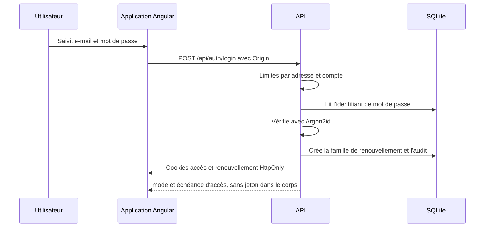
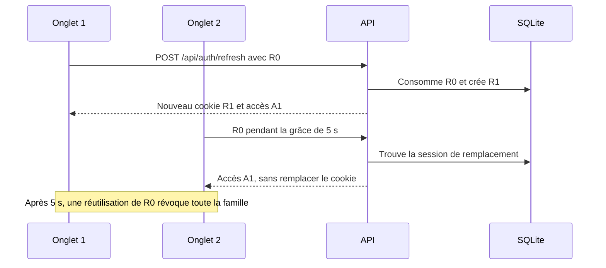
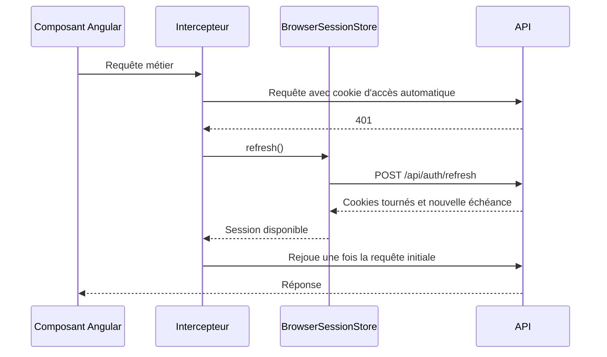
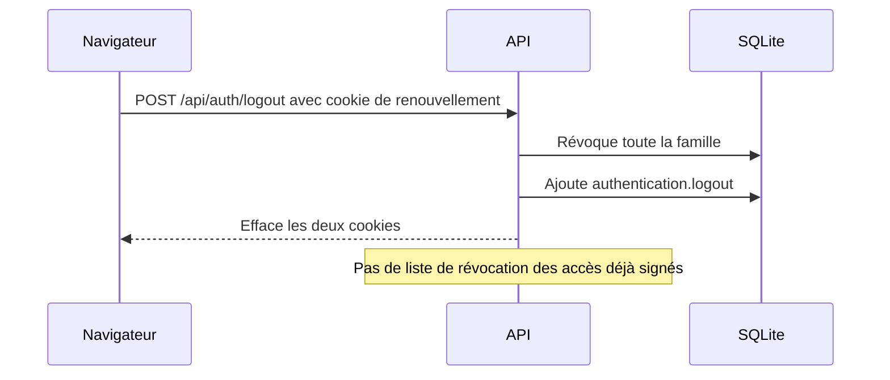
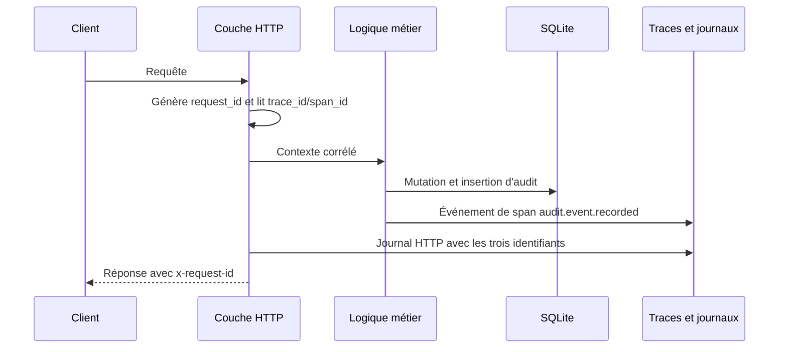

La sécurité réelle d’une application ne se résume pas au nom d’un algorithme. Elle dépend du trajet des identifiants, des vérifications effectuées à chaque requête, des états conservés et des limites connues. Cet article décrit l’implémentation actuelle de Froment Software à partir du code source. Il ne contient ni clé, ni jeton, ni valeur de secret.

## Table des matières

- [Deux cookies, deux fonctions](#deux-cookies-deux-fonctions)
- [Connexion et mots de passe](#connexion-et-mots-de-passe)
- [Jeton d’accès PASETO v4.public](#jeton-daccès-paseto-v4public)
- [Renouvellement opaque, rotation et rejeu](#renouvellement-opaque-rotation-et-rejeu)
- [Requêtes du navigateur et renouvellement Angular](#requêtes-du-navigateur-et-renouvellement-angular)
- [Déconnexion et révocation](#déconnexion-et-révocation)
- [Jetons API, permissions et quotas](#jetons-api-permissions-et-quotas)
- [Origin, SameSite et CSRF](#origin-samesite-et-csrf)
- [Audit et corrélation des traces](#audit-et-corrélation-des-traces)
- [Limites connues](#limites-connues)
- [Références dans le code](#références-dans-le-code)

## Deux cookies, deux fonctions

Après une connexion, le serveur écrit deux cookies `Secure`, `HttpOnly` et `SameSite=Strict`. JavaScript ne peut donc pas lire leur contenu. Le navigateur les joint automatiquement aux requêtes qui correspondent à leur chemin.

Le cookie `__Secure-froment-access` contient un jeton d’accès PASETO signé. Son chemin est `/api` et sa durée par défaut est de dix minutes. Le cookie `__Secure-froment-refresh` contient une valeur opaque. Son chemin, plus étroit, est `/api/auth` et sa durée absolue par défaut est de trente jours. Une rotation ne prolonge pas cette échéance absolue.

Le préfixe `__Secure-`, l’attribut `Secure` et les chemins réduisent l’exposition. `HttpOnly` empêche une lecture directe par un script injecté. Il n’empêche pas ce script de déclencher une requête depuis la page. `SameSite=Strict` réduit les envois intersites, sans remplacer toutes les validations côté serveur.

La configuration des cookies se trouve dans `packages/api/src/authentication/http.ts`. Les durées par défaut se trouvent dans `packages/api/src/runtime-config.ts`.

## Connexion et mots de passe

Les mots de passe sont hachés avec Argon2id. Les valeurs par défaut sont 19 456 Kio de mémoire, deux itérations, un degré de parallélisme et une sortie de 32 octets. Elles sont configurables. Le schéma SQLite impose aussi un préfixe de hachage `$argon2id$`. Voir `packages/api/src/authentication/password.ts`, `packages/api/src/runtime-config.ts` et `packages/api/src/database/schema.ts`.

Si l’adresse électronique n’existe pas, le service vérifie quand même un hachage Argon2id factice. Cette opération évite une différence grossière entre un compte absent et un mot de passe incorrect. La réponse reste `authentication.invalid_credentials` dans les deux cas. Cette mesure ne garantit pas une durée parfaitement identique pour tous les chemins.

Les échecs sont suivis séparément par adresse cliente et par HMAC de l’adresse électronique normalisée. Le délai augmente exponentiellement de une seconde à quinze minutes par défaut. Les connexions réussies ont aussi un quota par adresse et par compte. Ces états utilisent des caches en mémoire, avec capacité et durée de vie bornées. Voir `packages/api/src/authentication/authentication.ts`.

Un compte désactivé ne peut pas se connecter. Pour un compte client, l’accès client lié doit encore exister et le client ne doit pas être désactivé. Une connexion réussie crée la session et l’événement d’audit dans la même transaction SQLite.

## Jeton d’accès PASETO v4.public

Le jeton court utilise PASETO `v4.public`, donc une signature à clé publique et non un chiffrement. Son contenu n’est pas secret. Il contient `sub` pour l’utilisateur, `sid` pour la session, le mode, le type `access`, l’émetteur, l’audience `froment-browser`, la date d’émission et l’expiration.

Le serveur signe avec la clé privée configurée et déduit la clé publique Ed25519 au démarrage. La vérification contrôle la signature, le schéma des revendications, l’émetteur, l’audience, les dates et une durée exactement égale à la durée configurée. La tolérance d’horloge par défaut est de trente secondes. Voir `packages/api/src/authentication/paseto.ts` et `packages/api/src/authentication/authentication-config.ts`.

Après la signature, l’autorisation ne repose pas uniquement sur les revendications. Chaque requête relit l’utilisateur, son état et son mode dans SQLite. Les permissions demandées par la route doivent toutes appartenir aux rôles actuels de l’utilisateur. Une désactivation ou un retrait de rôle agit donc sans attendre un nouveau jeton. En revanche, l’authentification du jeton d’accès ne relit pas l’état de la famille de renouvellement.

## Renouvellement opaque, rotation et rejeu

Le jeton de renouvellement est une valeur aléatoire de 32 octets encodée en base64url. La base ne conserve pas cette valeur. Elle conserve un HMAC-SHA-256 calculé avec une clé distincte. Une lecture de la base seule ne fournit donc pas un jeton utilisable. Voir `packages/api/src/authentication/authentication.ts` et `packages/api/src/authentication/authentication-config.ts`.

Chaque renouvellement consomme la ligne courante et crée une ligne de remplacement dans la même transaction immédiate. Les lignes gardent un `family_id`, un lien vers la session suivante et l’échéance absolue initiale. Le serveur émet ensuite un nouveau jeton d’accès.

Une fenêtre de grâce de cinq secondes traite les renouvellements concurrents. Dans cette fenêtre, une seconde requête avec l’ancien cookie reçoit un jeton d’accès pour la session de remplacement, mais aucun nouveau jeton de renouvellement. La première réponse reste responsable du nouveau cookie. Après la grâce, la réutilisation de l’ancien jeton est traitée comme un rejeu. Le serveur révoque toute la famille et ajoute `authentication.refresh-replay-detected` à l’audit.

Le renouvellement refuse aussi une session expirée ou révoquée, un utilisateur désactivé et une session antérieure au dernier changement de mot de passe. Dans ces cas, le serveur révoque la famille quand il peut l’identifier.

## Requêtes du navigateur et renouvellement Angular

Angular ne stocke aucun jeton d’accès dans `localStorage`, `sessionStorage` ou un signal. Le signal `BrowserSessionStore` conserve uniquement le mode et l’heure d’expiration renvoyés dans le corps. Les deux secrets restent dans les cookies `HttpOnly`. Voir `packages/web/src/app/back-office/browser-session-store.ts`.

Le magasin planifie un renouvellement trente secondes avant l’expiration. Il relance aussi ce contrôle quand la page redevient visible ou reprend le focus. Il partage une promesse pour éviter plusieurs renouvellements simultanés dans un onglet. `navigator.locks` sérialise les rotations entre onglets quand cette API est disponible. Voir `packages/web/src/app/back-office/auth-cookie-lock.ts`.

L’intercepteur laisse le navigateur joindre le cookie d’accès. Après une réponse `401`, il tente un renouvellement partagé, puis rejoue la requête une seule fois si une session existe. Il exclut les routes de connexion, renouvellement, déconnexion, bootstrap, santé, version et les routes publiques. Il ne remplace jamais un en-tête `Authorization` explicite. Voir `packages/web/src/app/back-office/authentication-interceptor.ts`.

## Déconnexion et révocation

La déconnexion recherche le HMAC du cookie de renouvellement, puis marque comme révoquées toutes les sessions de sa famille. Elle écrit l’événement `authentication.logout` dans la même transaction. La réponse efface ensuite les deux cookies. Une déconnexion avec une session inconnue échoue aussi en effaçant les cookies. Voir `packages/api/src/authentication/handlers.ts` et `packages/api/src/authentication/authentication.ts`.

La révocation bloque immédiatement le prochain renouvellement. Elle ne place pas les jetons d’accès signés dans une liste de révocation. Un jeton d’accès déjà émis et encore valide peut donc fonctionner après la déconnexion jusqu’à son expiration, soit au plus dix minutes avec la configuration par défaut. Le navigateur normal efface son cookie lors de la réponse de déconnexion. Cette limite concerne surtout une copie déjà obtenue du jeton. Le vérificateur applique aussi sa tolérance d’horloge configurée de trente secondes autour de l’expiration.

## Jetons API, permissions et quotas

Les intégrations utilisent un format distinct commençant par `froment_api_v1_`. Le secret comprend un identifiant ULID et 32 octets aléatoires. L’API renvoie le secret lors de la création, puis ne conserve que son HMAC-SHA-256. L’authentification compare les HMAC avec `timingSafeEqual`. Un jeton expiré, révoqué ou lié à un administrateur désactivé est refusé. Voir `packages/api/src/api-tokens/service.ts`.

Un jeton API ne peut recevoir à sa création que des permissions détenues par son créateur. À chaque requête, l’autorisation vérifie l’intersection entre trois ensembles : les permissions exigées par la route, celles enregistrées pour le jeton et celles encore accordées aux rôles actuels de l’utilisateur. Le retrait d’un rôle réduit donc immédiatement les droits du jeton. Toutes les permissions exigées doivent être présentes.

La durée maximale par défaut d’un jeton API est d’un an. Son quota global par défaut est de 120 requêtes par minute, avec une valeur propre enregistrée pour chaque jeton. Le serveur applique aussi une limite par adresse avant l’authentification et, si la route le déclare, une limite par jeton et par route. Chaque utilisation ajoute un audit avec la route et le statut de réponse. Voir `packages/api/src/authentication/http.ts` et `packages/api/src/runtime-config.ts`.

Ces quotas sont des fenêtres fixes conservées en mémoire par `packages/api/src/server/request-limiter.ts`. Un redémarrage les remet à zéro. Plusieurs instances ne partagent pas leurs compteurs. Ils limitent les abus ordinaires sur une instance, mais ne constituent pas un quota distribué durable.

## Origin, SameSite et CSRF

Le middleware de navigateur exige une égalité exacte entre l’en-tête `Origin` et `PUBLIC_ORIGIN`. Il protège explicitement la connexion, le renouvellement, la déconnexion, le bootstrap et certaines opérations publiques sur les devis. Voir `packages/api/src/http/origin.ts`, `packages/contracts/src/authentication/api.ts`, `packages/contracts/src/bootstrap/api.ts` et `packages/contracts/src/quote-links/api.ts`.

Cette validation complète les cookies `SameSite=Strict`. Elle refuse aussi une requête sans `Origin` sur ces routes. Elle n’utilise pas de jeton CSRF synchronisé distinct.

Le contrôle `Origin` n’est pas appliqué globalement à toutes les mutations métier authentifiées. Les contrats de nombreuses routes métier passent par l’autorisation sans ajouter `requireBrowserOrigin`. Les jetons API doivent d’ailleurs pouvoir appeler ces routes hors navigateur. La défense actuelle des requêtes par cookie sur ces routes repose donc principalement sur `SameSite=Strict` et sur les règles du navigateur. Ce périmètre est une limite réelle, pas une propriété globale de l’API.

## Audit et corrélation des traces

Les événements d’audit contiennent un ULID, une action, un acteur éventuel, une ressource, une date et des métadonnées JSON bornées. Deux triggers SQLite interdisent toute mise à jour ou suppression de `audit_events`. Le journal est donc append-only au niveau de la base utilisée par l’application. Voir `packages/api/src/audit/audit.ts` et `packages/api/drizzle/20260823115906_audit_trace_correlation/migration.sql`.

Chaque requête reçoit un `request_id` UUID v4 généré par le serveur. Le serveur renvoie cette valeur dans `x-request-id` et l’ajoute aux journaux et aux spans. Le `trace_id` de 32 caractères hexadécimaux et le `span_id` de 16 caractères viennent du span Effect courant. Lors d’un audit dans le contexte HTTP, les trois identifiants sont copiés dans la ligne d’audit. Des index permettent les recherches par requête et par trace. Voir `packages/api/src/http/response.ts`, `packages/api/src/http/request-context.ts` et `packages/api/src/observability/http-tracing.ts`.

Append-only ne signifie pas inviolable. Un opérateur ayant un accès complet au fichier SQLite peut remplacer la base ou retirer les triggers. Le journal n’utilise ni chaînage cryptographique, ni stockage externe immuable dans ce code.

## Limites connues

- Un jeton d’accès valide peut rester utilisable après la déconnexion jusqu’à l’échéance de dix minutes par défaut. Le vérificateur a aussi une tolérance d’horloge de trente secondes.
- Les quotas de connexion, de renouvellement, de jetons API et de routes sont en mémoire. Ils sont remis à zéro au redémarrage et ne sont pas partagés entre instances.
- Le contrôle strict de `Origin` protège les routes qui déclarent le middleware. Il n’est pas global sur toutes les mutations métier authentifiées.
- La politique de confidentialité est incohérente avec le code actuel. Elle affirme que le jeton d’accès reste en mémoire, alors que le serveur le place dans un cookie `__Secure-froment-access` `HttpOnly`. La page sur les cookies annonce bien deux cookies, mais son résumé ne nomme que le cookie de renouvellement. Voir `packages/l10n/src/translations.ts`.
- PASETO `v4.public` signe les revendications mais ne les chiffre pas. Aucun secret ne doit être placé dans sa charge utile.
- L’audit append-only dépend des triggers et de l’intégrité du fichier SQLite. Il n’apporte pas, seul, une preuve cryptographique externe.

Ces limites ne rendent pas les mécanismes inutiles. Elles définissent leur garantie exacte et indiquent où un déploiement distribué ou un modèle de menace plus strict demande un contrôle supplémentaire.

## Références dans le code

- `packages/api/src/authentication/authentication.ts` : connexion, sessions, rotation, grâce, rejeu, déconnexion et permissions des utilisateurs.
- `packages/api/src/authentication/paseto.ts` : émission et validation PASETO `v4.public`.
- `packages/api/src/authentication/password.ts` : Argon2id.
- `packages/api/src/authentication/http.ts` et `packages/api/src/authentication/handlers.ts` : cookies et routes HTTP.
- `packages/api/src/api-tokens/service.ts` : secrets, HMAC, expiration, révocation et intersection des permissions des jetons API.
- `packages/api/src/server/request-limiter.ts` et `packages/api/src/runtime-config.ts` : quotas et valeurs par défaut.
- `packages/api/src/http/origin.ts` et `packages/contracts/src/api-policy/origin.ts` : contrôle `Origin` opt-in.
- `packages/api/src/audit/audit.ts` et `packages/api/drizzle/20260823115906_audit_trace_correlation/migration.sql` : audit append-only et identifiants corrélés.
- `packages/web/src/app/back-office/browser-session-store.ts`, `authentication-interceptor.ts` et `auth-cookie-lock.ts` : renouvellement Angular.
- `packages/l10n/src/translations.ts` : texte actuel de confidentialité et des cookies.
