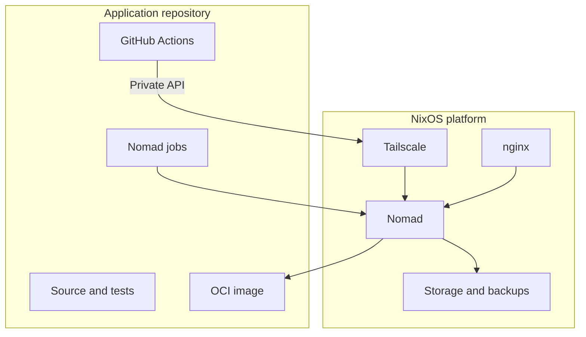
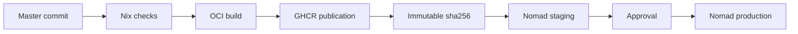
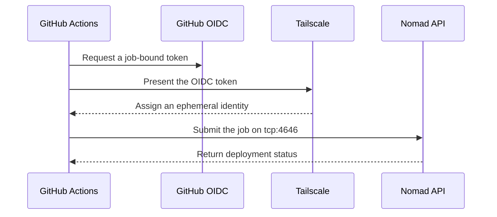
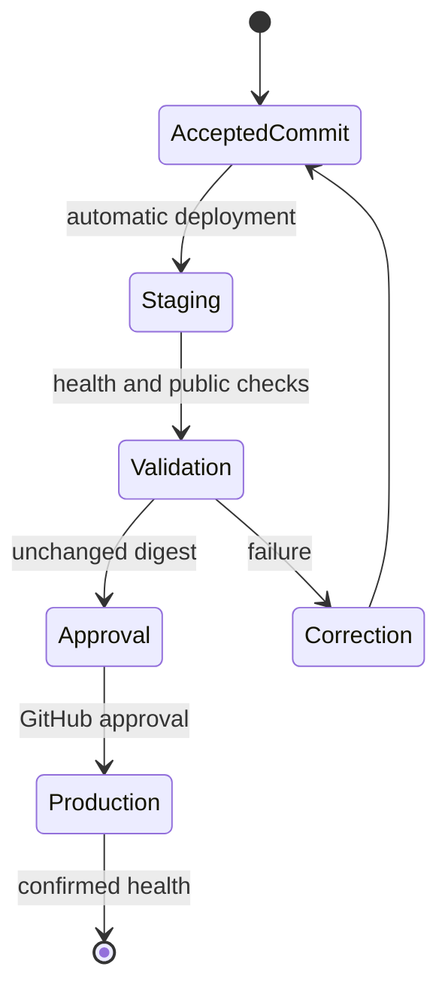

A reliable release must connect tested source, the published artifact, and the running version. The new Froment Software pipeline uses Nix, GitHub Actions, Tailscale, and Nomad. It deploys every accepted commit to staging, then promotes the same digest to production.

## Table of contents

- [Separate the platform from applications](#separate-the-platform-from-applications)
- [Develop on one trunk](#develop-on-one-trunk)
- [Build once](#build-once)
- [Prove the image origin](#prove-the-image-origin)
- [Reach Nomad without a public port](#reach-nomad-without-a-public-port)
- [Isolate environments](#isolate-environments)
- [Promote the staging digest](#promote-the-staging-digest)
- [Protect SQLite during migrations](#protect-sqlite-during-migrations)
- [Return to a known version](#return-to-a-known-version)

## Separate the platform from applications

NixOS manages the stable platform. This layer contains Nomad, Tailscale, nginx, firewall rules, storage roots, and backups.

Nomad manages the application lifecycle. A job defines the image, port, resources, health checks, and volume.

An application release does not require `nixos-rebuild switch`. GitHub Actions only submits a new Nomad job version.

This boundary reduces release work. Infrastructure changes still use a NixOS activation.

## Develop on one trunk

The repository uses trunk-based development. A short-lived branch carries each change, and a pull request controls its integration.

The `master` branch stays releasable. Its history is linear, and force pushes are forbidden.

Each accepted commit automatically triggers staging. There is no persistent `develop` or `staging` branch.

`APP_ENV=development` remains local. Deployments use `APP_ENV=staging` or `APP_ENV=production`.

## Build once

Nix builds the application and its OCI image. The lock file fixes the dependencies used by this build.

CI publishes the image to GitHub Container Registry (GHCR). A commit tag helps discovery, but Nomad uses the digest.

A digest identifies the exact image content. A registry content change produces a different digest.

Production rebuilds nothing. It receives the digest that already ran on staging.

## Prove the image origin

Publication attaches three records to the digest:

- an SPDX software bill of materials, or SBOM;
- GitHub provenance linked to the commit and workflow;
- a keyless Cosign signature.

Cosign uses the GitHub job OpenID Connect (OIDC) identity. The production workflow verifies this identity before promotion.

These records answer separate questions. The SBOM describes content, provenance describes the build, and the signature identifies the producer.

## Reach Nomad without a public port

The Nomad API listens only on the server Tailscale address. nginx never publishes this API.

The GitHub runner gets an ephemeral Tailscale identity through OIDC federation. GitHub stores no reusable Tailscale secret.

A grant lets `tag:github-actions-deploy` reach `tag:nixconfig-server` only on `tcp:4646`.

Nomad then applies its own access control lists. Staging and production tokens have different permissions.

## Isolate environments

Staging and production each have a job, volume, Nomad token, and Nomad Variables path.

Secret values can match during a transition. Their storage and permissions remain separate.

Nomad injects secrets at startup. The OCI image and repository do not contain them.

Angular receives only two public values in `/runtime-config.js`: `APP_ENV` and `SITE_PHASE`.

`SITE_PHASE` controls the commercial message. It remains independent from the technical environment.

Staging is public but sends `X-Robots-Tag: noindex, nofollow`. It no longer uses shared HTTP authentication.

## Promote the staging digest

Production uses a manual workflow protected by the GitHub `production` environment. Human review authorizes its execution.

The workflow reads the active staging digest. It then verifies the signature and provenance before submitting the production job.

This promotion prevents a silent difference between the tested version and the delivered version.

## Protect SQLite during migrations

Froment Software uses one SQLite writer per environment. Each Nomad job therefore keeps one active allocation.

Before a migration, `tools/prepare.sh` creates a consistent backup. It then checks SQLite integrity and foreign keys.

Production refuses to start if its database does not exist. An empty mount cannot create an empty production service.

Migration from the former Compose service uses a controlled cutover. Writes stop before the final backup and copy.

## Return to a known version

Nomad keeps job history and can restore a previous version. This action is sufficient when the data schema remains compatible.

A destructive migration also requires restoring its associated backup. The image and database then form one rollback unit.

This architecture does not remove release risk. It makes the path, permissions, and artifact verifiable at every step.
