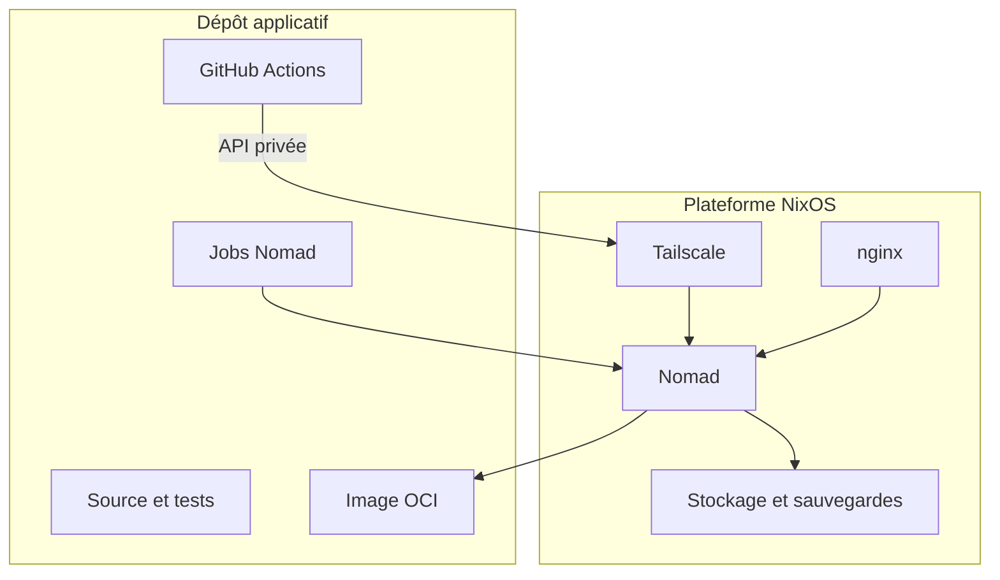
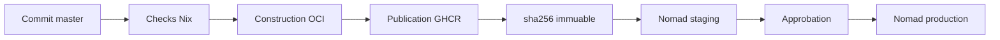
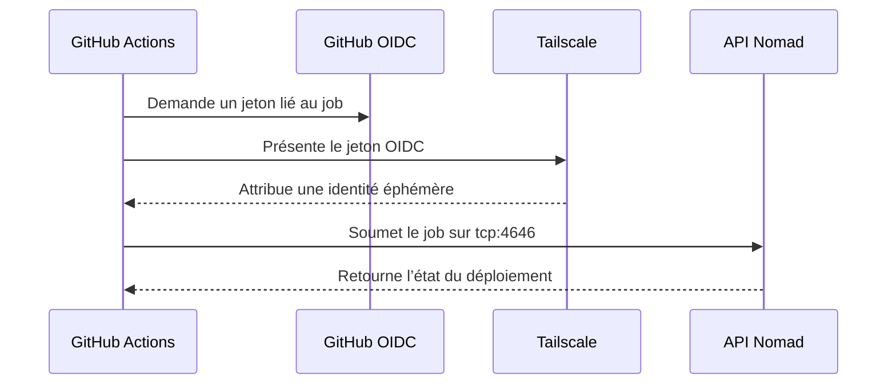
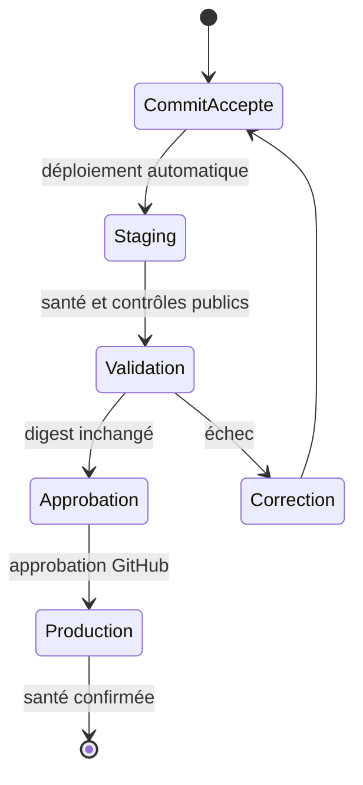

Une livraison fiable doit relier le code testé, l’artefact publié et la version exécutée. La nouvelle chaîne de Froment Software utilise Nix, GitHub Actions, Tailscale et Nomad. Elle déploie chaque commit accepté sur staging, puis promeut le même digest en production.

## Table des matières

- [Séparer la plateforme et les applications](#séparer-la-plateforme-et-les-applications)
- [Développer sur une branche principale](#développer-sur-une-branche-principale)
- [Construire une seule fois](#construire-une-seule-fois)
- [Prouver l’origine de l’image](#prouver-lorigine-de-limage)
- [Joindre Nomad sans port public](#joindre-nomad-sans-port-public)
- [Isoler les environnements](#isoler-les-environnements)
- [Promouvoir le digest staging](#promouvoir-le-digest-staging)
- [Protéger SQLite pendant les migrations](#protéger-sqlite-pendant-les-migrations)
- [Revenir à une version connue](#revenir-à-une-version-connue)

## Séparer la plateforme et les applications

NixOS gère la plateforme stable. Cette couche contient Nomad, Tailscale, nginx, le pare-feu, les racines de stockage et les sauvegardes.

Nomad gère le cycle de vie applicatif. Un job définit l’image, le port, les ressources, les contrôles de santé et le volume.

Une version applicative ne nécessite donc pas `nixos-rebuild switch`. GitHub Actions soumet seulement une nouvelle version du job Nomad.

Cette limite réduit le coût d’une livraison. Elle conserve une activation NixOS pour les changements d’infrastructure.

## Développer sur une branche principale

Le dépôt utilise le développement trunk-based. Une branche courte porte chaque changement et une pull request contrôle son intégration.

La branche `master` reste toujours livrable. Son historique est linéaire et les force-pushes sont interdits.

Chaque commit accepté déclenche automatiquement staging. Il n’existe pas de branche persistante `develop` ou `staging`.

`APP_ENV=development` reste réservé au poste local. Les déploiements utilisent `APP_ENV=staging` ou `APP_ENV=production`.

## Construire une seule fois

Nix construit l’application et son image OCI. Le fichier de verrouillage fixe les dépendances utilisées par cette construction.

La CI publie l’image dans GitHub Container Registry (GHCR). Un tag de commit facilite sa recherche, mais Nomad utilise son digest.

Un digest désigne le contenu exact de l’image. Une modification du registre produit un autre digest.

La production ne reconstruit rien. Elle reçoit le digest déjà exécuté sur staging.

## Prouver l’origine de l’image

La publication ajoute trois preuves au digest :

- une nomenclature logicielle SPDX, ou SBOM ;
- une provenance GitHub liée au commit et au workflow ;
- une signature Cosign sans clé persistante.

Cosign utilise l’identité OpenID Connect (OIDC) du job GitHub. Le workflow production vérifie cette identité avant la promotion.

Ces preuves répondent à trois questions distinctes. La SBOM décrit le contenu, la provenance décrit la construction et la signature identifie le producteur.

## Joindre Nomad sans port public

L’API Nomad écoute uniquement sur l’adresse Tailscale du serveur. nginx ne publie jamais cette API.

Le runner GitHub obtient une identité Tailscale éphémère par fédération OIDC. Aucun secret Tailscale réutilisable n’est stocké dans GitHub.

Une règle autorise `tag:github-actions-deploy` à joindre `tag:nixconfig-server` uniquement sur `tcp:4646`.

Nomad applique ensuite ses propres listes de contrôle d’accès. Les jetons staging et production n’ont pas les mêmes droits.

## Isoler les environnements

Staging et production ont chacun un job, un volume, un jeton Nomad et un chemin Nomad Variables.

Les valeurs secrètes peuvent être identiques pendant une transition. Leur stockage et leurs droits restent néanmoins séparés.

Nomad injecte les secrets au démarrage. L’image OCI et le dépôt ne les contiennent pas.

Angular reçoit seulement deux valeurs publiques dans `/runtime-config.js` : `APP_ENV` et `SITE_PHASE`.

`SITE_PHASE` contrôle le message commercial. Il reste indépendant de l’environnement technique.

Staging est public, mais envoie `X-Robots-Tag: noindex, nofollow`. Il n’utilise plus d’authentification HTTP partagée.

## Promouvoir le digest staging

La production utilise un workflow manuel protégé par l’environnement GitHub `production`. Un examen humain autorise son exécution.

Le workflow lit le digest actif sur staging. Il vérifie ensuite la signature et la provenance avant de soumettre le job production.

Cette promotion évite un écart discret entre la version testée et la version livrée.

## Protéger SQLite pendant les migrations

Froment Software utilise un seul écrivain SQLite par environnement. Chaque job Nomad conserve donc une seule allocation active.

Avant une migration, `tools/prepare.sh` crée une sauvegarde cohérente. Il contrôle ensuite l’intégrité SQLite et les clés étrangères.

La production refuse de démarrer si sa base n’existe pas. Un montage vide ne peut donc pas créer une production vierge.

La migration depuis l’ancien service Compose suit une coupure contrôlée. Les écritures s’arrêtent avant la dernière sauvegarde et la copie.

## Revenir à une version connue

Nomad conserve l’historique des jobs et peut restaurer une version précédente. Cette action suffit si le schéma de données reste compatible.

Une migration destructive demande aussi la restauration de la sauvegarde associée. L’image et la base forment alors une unité de retour arrière.

Cette architecture ne supprime pas le risque d’une livraison. Elle rend le chemin, les droits et l’artefact vérifiables à chaque étape.
